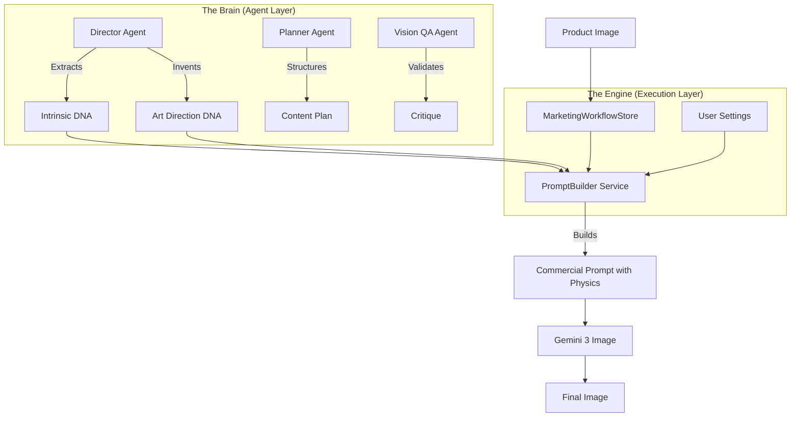

# E-commerce Image Generator - System Architecture & AI Manual

> **For Future AI Agents**: This document serves as the "Cognitive Map" of the project. Read this first to understand how the "Deep Vision" engine, Marketing Workflow, and Agent System interact.

## 1. System Identity
**Name**: E-commerce Image Generator (Pro Edition)
**Core Mission**: Transform basic product images into commercial-grade marketing assets using AI agents and deep visual analysis.
**Tech Stack**: Vue 3, TypeScript, Pinia, Gemini 3 Pro (Brain), Gemini 3 Pro (Image).

## 2. Core Architecture: The "Brain-Body" Model

The system follows a strict separation between **Cognitive Planning (Brain)** and **Execution (Body)**.

## 3. Key Subsystems (The "Magic")

### 3.1 Deep Vision 2.0 (The Visual Engine)
This is the core differentiator. It decouples "What it is" from "How it looks".

*   **Logic Source**: `src/services/promptBuilder.ts`, `src/prompts/marketingPrompts.ts`
*   **Data Types**: `src/types/index.ts` (`ProductIntrinsicDNA`, `ArtDirectionDNA`)

#### The Twin-Engine DNA
1.  **Product Intrinsic DNA (The Facts)**:
    *   **Immutable**. Extracted by the Director Agent (Material Scientist).
    *   *Components*: Material Surface (e.g., "Matte Aluminum"), Form Factor, Brand Colors.
    *   *Role*: Ensures the product looks correct in every generated image.
2.  **Art Direction DNA (The Style)**:
    *   **Mutable**. Invented by the Director Agent (Cinematographer) or inferred by System.
    *   *Components*:
        *   **Lighting**: Style (Rembrandt), Direction (Rim Light).
        *   **Camera (Optical Mechanics)**: **NEW in V2**. Defines Lens (85mm), Aperture (f/1.8), Shutter.
        *   **Grading**: Color Tone.
        *   **Negative DNA**: **NEW in V2**. Brand Taboos (forbidden elements).

### 3.2 Marketing Workflow (The Agent Loop)
A 4-step guided process implemented in `src/components/marketing-workflow/`.

1.  **Product Analysis**: User uploads image -> Director Agent extracts `IntrinsicDNA`.
2.  **Strategy Selection**: Director Agent proposes 3 distinct `MarketingRoutes` (each with unique `ArtDirectionDNA`).
3.  **Content Planning**: Planner Agent expands selected route into an 8-image storyboard (AIDA model).
4.  **Batch Generation**: System executes the plan using `PromptBuilder`.

### 3.3 PromptBuilder Architecture
A strictly layered prompt construction service (`src/services/promptBuilder.ts`). The `DEEP_VISION` layer (1.35 weight) is crucial.

**Layer Stack:**
1.  **CORE_SUBJECT** (1.5): Main visual description.
2.  **DEEP_VISION** (1.35): Injects DNA (Lens, Material, Lighting).
3.  **MARKETING** (1.25): Injects advertising psychology.
4.  **QUALITY/STYLE** (1.3/1.1): Standard quality boosters.
5.  **NEGATIVE** (1.0): Injects global negatives + **Deep Vision Negative Constraints**.

### 3.4 System-Wide Inference (The "Autopilot")
Even in **Quick Generation** mode (outside marketing workflow), `generationStore.ts` automatically maps basic user settings to complex DNA.

*   *Example*: User picks "Dramatic Lighting".
*   *System Infers*:
    *   **Lens**: "35mm Cinematic Prime"
    *   **Aperture**: "f/1.8"
    *   **Negative**: "flat lighting, washed out"

## 4. Operational Data Flow

### How a Request Travels
1.  **Trigger**: User clicks "Generate" (Batch or Single).
2.  **Context Assembly**: `BatchGenerationStep` or `generationStore` gathers data.
    *   Fetches `ProductIntrinsicDNA` from `marketingWorkflowStore.productAnalysis`.
    *   Fetches `ArtDirectionDNA` from `marketingWorkflowStore.selectedRoute` OR infers from settings.
3.  **Construction**: `createPromptBuilder()` is initialized.
    *   `.setDeepVision(intrinsic, artDirection)` is called.
    *   `.build()` executes all layers.
4.  **Physics Injection**: `buildDeepVisionLayer()` translates DNA objects into string keywords (e.g., `{ aperture: 'f/1.8' }` -> "Aperture f/1.8").
5.  **API Call**: Final prompt sent to Gemini. Reference images attached if consistency is enabled.

## 5. Developer / AI Index (Key Files)

| Component | Path | Role |
| :--- | :--- | :--- |
| **Brain** | `src/prompts/marketingPrompts.ts` | **CRITICAL**. Defines Agent Personas (Optical Engineer, Material Scientist). |
| **Data Types** | `src/types/index.ts` | Defines the DNA structures. Check here for field definitions. |
| **Engine** | `src/services/promptBuilder.ts` | The logic that converts DNA to text. Handles layers and weights. |
| **State** | `src/stores/marketingWorkflowStore.ts` | Holds the active analysis results and route selection. |
| **Inference** | `src/stores/generationStore.ts` | Contains the "Quick Mode" mapping logic (Settings -> DNA). |
| **UI** | `src/components/marketing-workflow/` | The UI steps (Analysis, Strategy, Generation). |

## 6. Future "Deep Vision" Expansion Roadmap
*   **Psychological Layer**: Mapping visual styles to emotional keywords (Trust, Excitement).
*   **Constraint Solver**: Advanced conflict resolution between Intrinsic DNA and Scene Context.
