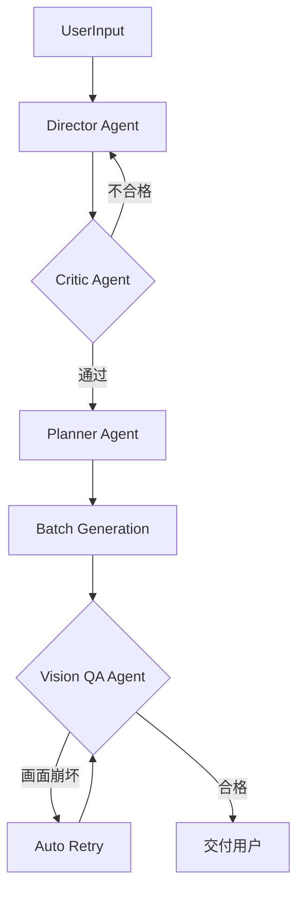

 1 +# AI-PM-Designer-Pro 融合方案（优化版）


       2
       3  ## 项目背景


       4
       5 -将 AI-PM-Designer-Pro-main 项目的优秀功能借鉴融合到现有的 ecommerce-image-generator 系统中，增强系统的营销能力。


       5 +将 AI-PM-Designer-Pro 的优秀功能融合到 ecommerce-image-generator 系统，增强营销能力。


       6
       7 -## 待融合的核心功能


       7 +## 核心功能


       8
       9  1. **两阶段营销工作流**（策略制定 → 内容执行）


      10 -2. **智能颜色参考系统**（Canvas API 提取主色调）


      11 -3. **内容审阅编辑模式**（生成前可编辑企划）


      12 -4. **AIDA 营销漏斗模型**（8张图故事化流程）


      10 +2. **智能颜色提取**（Canvas API 提取主色调，内置于工作流）


      11 +3. **内容审阅编辑**（生成前可编辑企划）


      12 +4. **AIDA 营销漏斗**（8张图故事化流程）


      13
      14 -## 融合方式深度对比分析


      14 +---
      15
      16 -经过 Plan agent 的详细评估，三种方式的对比如下：


      16 +## 原方案问题分析


      17
      18 -### 方式一：功能增强式 ⭐⭐⭐⭐⭐ (最终推荐)


      18 +### ❌ 架构太分散


      19 +- 新增 4 个独立 Store（colorReferenceStore, marketingStrategyStore, aidaContentStore, marketingSuiteStore）


      20 +- 状态管理碎片化，维护成本高


      21
      22 -**核心思路**：保持现有 Vue + Pinia 架构，将新功能作为模块集成到高级模式


      22 +### ❌ UI 融合生硬


      23 +- 把两阶段工作流塞进 AdvancedPage 的 Tab 3


      24 +- 与"融合"、"一致性"功能并列不协调（前者是单图增强，后者是完整工作流）


      25
      26 -**架构可行性验证**：✅ **高度可行**


      27 -- 两个系统都基于组件化设计和类似的状态管理模式


      28 -- 技术栈一致（TypeScript、Gemini API、分层提示词）


      29 -- 现有系统的 PromptBuilder、Store 架构已预留扩展空间


      26 +### ❌ 破坏设计理念


      27 +- AI-PM-Designer 的核心价值是**完整的两阶段工作流**


      28 +- 强行拆分会丢失其设计优势


      29
      30 -**优势**：

      31 -- ✅ **风险最低**：不破坏现有功能，渐进式开发


      32 -- ✅ **利用现有基础**：充分复用10层提示词系统、双API引擎、智能推荐


      33 -- ✅ **符合分阶段实施**：可以逐个功能迭代，每个阶段独立可用


      34 -- ✅ **开发效率高**：复用大量现有代码和服务


      35 -- ✅ **功能协同强**：可与现有融合、一致性系统组合使用


      36 -- ✅ **用户体验优秀**：统一界面，共享数据，无需切换模块


      37 -- ✅ **长期价值高**：系统整体升级，而非功能孤岛


      30 +---
      31
      32 -**劣势及解决方案**：


      33 -- ⚠️ **功能臃肿风险**


      34 -  - 解决：重新组织高级模式标签页，采用渐进式披露设计


      35 -- ⚠️ **UI组织挑战**


      36 -  - 解决：独立的营销策略页面，清晰的进度指示器


      37 -- ⚠️ **功能重叠**


      38 -  - 解决：将现有营销套图升级为两阶段工作流，而非新增


      32 +## 优化方案：工作流统一式 ⭐⭐⭐⭐⭐


      33
      34 +### 核心思路


      35 +
      36 +
**不是"功能增强"，而是作为独立的第三种模式：Agentic Creative Workflow (智能创意工作流)**

**核心升级**：从线性的 "A -> B -> C" 进化为带反馈的 "A <-> B -> C (QA)" 闭环系统。


      37 +
      38  **优化后的架构设计**：


      39
      40  #### 关键优化点 1：提示词架构扩展


● Updated plan
  ⎿  /plan to preview
       35
       36  **不是"功能增强"，而是作为独立的第三种模式**


       37
       38 +```
       39 +模式切换导航：


       40 +┌──────────────────────────────────────────────────┐
       41 +│  [🚀 快速生成]  [⚙️ 高级模式]  [📊 营销企划]  │


       42 +└──────────────────────────────────────────────────┘
       43 +
       44 +快速生成 = 单图快速出图（现有）


       45 +高级模式 = 单图高级控制（现有：融合、一致性）


       46 +营销企划 = 套图完整工作流（新增：策略→企划→批量生成）


       47 +```
```
       48 +
       49 +### 架构优势


       50 +
       51 +| 对比项 | 原方案 | 优化方案 |
       52 +|--------|--------|----------|
       53 +| 新增 Store | 4 个 | **1 个** |
       54 +| UI 位置 | 塞进高级模式 Tab 3 | **独立第三模式** |
       55 +| 颜色提取 | 独立功能 | **内置于工作流** |
       56 +| 用户认知 | 功能混杂 | **清晰分离** |
       57 +| 开发复杂度 | 高（多处改动） | **低（独立开发）** |
       58 +
### 1. 核心架构：Agentic Loop 模式

引入 **Critic (批评家)** 和 **Vision QA (视觉质检)** 两个关键反馈环。



### 2. Store 设计：单一 Store 整合所有状态

```typescript
// src/stores/marketingWorkflowStore.ts

// 状态流转 (新增 CRITIQUE 和 QA 状态)
IDLE → ANALYZING → CRITIQUING → STRATEGY_READY → PLANNING → GENERATING → QUALITY_CHECK → COMPLETED

// 核心状态
interface MarketingWorkflowState {
  currentStep: WorkflowStep
  
  // Agent 思考日志 (用于 UI 展示)
  thoughtLog: AgentThought[]
  
  // Phase 1 Agents
  directorOutput: DirectorOutput | null
  criticFeedback: CriticFeedback | null  // 批评意见
  
  // ... Phase 2 Agents ...
}
```
       60 +
       61 +## 详细架构设计


       62 +
       63 +#### 关键优化点 1：提示词架构扩展


       64 +
       65 +```typescript
       66 +// 只新增 1 个核心 Store


       67 +src/stores/marketingWorkflowStore.ts
       68 +
       69 +// 状态流转


       70 +IDLE → ANALYZING → STRATEGY_READY → PLANNING → PLAN_READY → GENERATING → COMPLETED
       71 +       (Step 1)     (Step 2)         (Step 3)   (Step 4)
       72 +
       73 +// 核心状态


       74 +interface MarketingWorkflowState {
       75 +  currentStep: WorkflowStep
       76 +
       77 +  // Step 1: 产品分析


       78 +  productAnalysis: ProductAnalysis | null
       79 +  extractedColors: string[]  // 颜色提取结果（内置）


       80 +
       81 +  // Step 2: 策略选择


       82 +  marketingRoutes: MarketingRoute[]  // 3条路线

       83 +  selectedRouteIndex: number
       84 +
       85 +  // Step 3: 内容企划


       86 +  brandContext: string
       87 +  referenceCopy: string
       88 +  contentPlan: ContentPlan | null
       89 +  editedItems: ContentItem[]  // 8张图，可编辑


       90 +
       91 +  // Step 4: 生成
       92 +  generationProgress: { current, total, status }
       93 +}
       94 +```
       95 +
       96 +### 2. 服务扩展：引入 Agents 层
**不是简单的 Service 调用，而是封装为 Agent Class**

```typescript
src/agents/
├── core/
│   ├── BaseAgent.ts         // 定义 think(), act() 接口
│   └── AgentOrchestrator.ts // 简单的调度器
├── DirectorAgent.ts         // 策略制定 (含 CoT 思考)
├── CriticAgent.ts           // 策略审查 (Self-Correction)
├── PlannerAgent.ts          // 内容规划
└── VisionQAAgent.ts         // 视觉与合规性检查
```

### 3. Gemini Client 扩展
```typescript
// geminiClient.ts - 新增 analyzeImage() 用于 Vision QA
analyzeImage(image: string, prompt: string) → { pass: boolean, reason: string }
```
      104 +```
      105 +
      106 +### 3. UI 设计：步骤化工作流


      107 +
      108 +```
      109 +MarketingWorkflowPage.vue（独立页面）


      110 +┌─────────────────────────────────────────────────┐
      111 +│ 步骤指示器                                       │


      112 +│ [1.产品分析] → [2.策略选择] → [3.内容企划] → [4.批量生成] │


      113 +├─────────────────────────────────────────────────┤
      114 +│                                                 │
      115 +│  根据当前步骤显示对应面板                         │


      116 +│                                                 │
      117 +│  Step 1: ProductAnalysisStep.vue                │
      118 +│    - 复用现有 ProductInfoSection                 │


      119 +│    - 复用现有 ImageUploader                      │


      120 +│    - 品牌背景输入 + 开始分析按钮                  │


      121 +│    - 自动提取颜色（内置，非独立功能）              │


      122 +│                                                 │
      123 +│  Step 2: StrategySelectionStep.vue              │
      124 +│    - 3 张 RouteCard（路线名、目标客群、视觉风格） │


      125 +│    - 概念海报预览（可选生成）                     │


      126 +│    - 选择路线按钮                                │


      127 +│                                                 │
      128 +│  Step 3: ContentPlanningStep.vue                │
      129 +│    - 参考文案输入框                              │


      130 +│    - 8 张 ContentItemCard（审阅模式）            │


      131 +│    - 每张可编辑：标题、文案、提示词               │


      132 +│                                                 │
      133 +│  Step 4: BatchGenerationStep.vue                │
      134 +│    - 8 张 ProductionCard（生成模式）             │


      135 +│    - 进度条 + 状态显示                           │


      136 +│    - 批量下载 ZIP 按钮                           │


      137 +│                                                 │
      138 +└─────────────────────────────────────────────────┘
      139 +```
      140 +
      141 +### 4. 数据流设计


      142 +
      143 +```
      144 +productStore (现有，共享产品信息)


      145 +       │
      146 +       │ 读取 productInfo, primaryImage
      147 +       ▼
      148 +marketingWorkflowStore (新增，唯一核心)


      149 +       │
      150 +       ├─ analyzeProduct()
      151 +       │   └─ 颜色提取 + AI 分析 → 3条路线


      152 +       │
      153 +       ├─ selectRoute(index)
      154 +       │   └─ 选择路线


      155 +       │
      156 +       ├─ generateContentPlan()
      157 +       │   └─ AI 生成 8 张图企划


      158 +       │
      159 +       └─ generateAllImages()
      160 +           └─ 循环调用 geminiClient → 图片结果


      161 +       │
      162 +       ▼
      163 +geminiClient (现有，扩展 analyzeWithText)


      164 +       │
      165 +       ▼
      166 +promptBuilder (现有，扩展 MARKETING + AIDA 层)


      167 +```
      168 +
      169 +---
      170 +
      171 +## 文件变更清单


      172 +
      173 +### 新增文件（共 12 个）


      174 +
      175 +```
      176 +src/stores/marketingWorkflowStore.ts          # 核心 Store (~400行)

      177 +
      178 +src/components/marketing-workflow/
      179 +├── index.ts
      180 +├── MarketingWorkflowPage.vue                 # 主页面 (~150行)


      181 +├── WorkflowStepper.vue                       # 步骤导航 (~80行)


      182 +├── steps/
      183 +│   ├── ProductAnalysisStep.vue               # Step 1 (~120行)
      184 +│   ├── StrategySelectionStep.vue             # Step 2 (~150行)
      185 +│   ├── ContentPlanningStep.vue               # Step 3 (~180行)
      186 +│   └── BatchGenerationStep.vue               # Step 4 (~150行)
      187 +├── cards/
      188 +│   ├── RouteCard.vue                         # 路线卡片 (~100行)


      189 +│   └── ContentItemCard.vue                   # 内容项卡片 (~120行)


      190 +└── utils/
      191 +    └── colorExtractor.ts                     # 颜色提取 (~100行)


      192 +
      193 +src/prompts/marketingPrompts.ts               # 系统提示词 (~400行)


      194 +```
      195 +
      196 +### 修改文件（共 5 个）


      197 +
      198 +```
      199 +src/App.vue                    # 添加第三种模式切换


      200 +src/services/promptBuilder.ts  # +MARKETING 层 +AIDA 层 (~80行)

      201 +src/services/geminiClient.ts   # +analyzeWithText 方法 (~60行)

      202 +src/types/index.ts             # +营销相关类型定义 (~50行)


      203 +src/stores/index.ts            # 导出新 Store

      204 +```
      205 +
      206 +### 可删除文件（简化架构）


      207 +
      208 +```
      209 +src/stores/marketingStore.ts              # 被新 Store 替代


      210 +src/components/marketing/MarketingTemplates.vue  # 被新组件替代


      211 +```
      212 +
      213 +### 代码量统计


      214 +
      215 +| 类别 | 新增行数 |


      216 +|------|---------|
      217 +| Store | ~400 |
      225 +
      226 +---
      227 +
      228 +## 分阶段实施计划


      229 +
      230 +### Phase 1: 基础架构（2-3 天）


      231 +
      232 +**目标**：搭建核心框架


      233 +
      234 +**交付物**：


      235 +1. `marketingWorkflowStore.ts` - 状态管理骨架


      236 +2. `geminiClient.ts` 扩展 - analyzeWithText 方法


      237 +3. `promptBuilder.ts` 扩展 - MARKETING + AIDA 层

      238 +4. `marketingPrompts.ts` - 系统提示词（从 AI-PM-Designer 迁移）


      239 +5. 类型定义


      240 +
      241 +**验证标准**：


      242 +- [ ] Store 状态流转正确


      243 +- [ ] analyzeWithText 可调用成功


      244 +- [ ] 提示词层正确组合


      245 +
      246 +### Phase 2: UI 框架（2-3 天）


      247 +
      248 +**目标**：完成 UI 骨架


      249 +
      250 +**交付物**：


      251 +1. `MarketingWorkflowPage.vue` - 主页面

      252 +2. `WorkflowStepper.vue` - 步骤导航


      253 +3. 4 个步骤组件骨架


      254 +4. `App.vue` 修改 - 三模式切换


      255 +
      256 +**验证标准**：


      257 +- [ ] 可切换到营销企划模式


      258 +- [ ] 步骤导航正确显示


      259 +- [ ] 各步骤面板可切换


      260 +
      261 +### Phase 3: 功能实现（4-5 天）


      262 +
      263 +**目标**：完成完整工作流


      264 +
      265 +**交付物**：


      266 +1. Step 1 完整实现（产品分析 + 颜色提取）


      267 +2. Step 2 完整实现（策略选择 + 概念预览）


      268 +3. Step 3 完整实现（内容企划 + 审阅编辑）


      269 +4. Step 4 完整实现（批量生成 + 进度显示）


      270 +
      271 +**验证标准**：


      272 +- [ ] 上传产品图 → AI 生成 3 条路线


      273 +- [ ] 选择路线 → AI 生成 8 张图企划


      274 +- [ ] 可编辑每张图的标题、文案、提示词


      275 +- [ ] 可批量生成 8 张图


      276 +
      277 +### Phase 4: 完善优化（1-2 天）


      278 +
      279 +**目标**：完善用户体验


      280 +
      281 +**交付物**：


      282 +1. 批量下载功能（ZIP 打包 + 智能命名）


      283 +2. 错误处理和重试机制


      284 +3. 加载状态优化


      285 +4. 响应式布局


      286 +
      287 +**验证标准**：


      288 +- [ ] ZIP 下载文件名正确


      289 +- [ ] 单张失败不影响其他


      290 +- [ ] 加载状态清晰


      291 +
      292 +---
      293 +
      294 +## 关键技术实现


      295 +
      296 +### 1. 颜色提取（内置于产品分析）


      297 +
      298 +```typescript
      299 +// colorExtractor.ts
      300 +export async function extractColorsFromImage(imageBase64: string): Promise<string[]> {
      301 +  // Canvas API 分析像素


      302 +  // 量化到 32 级


      303 +  // 跳过透明和白色


      304 +  // 返回前 5 个主色调 HEX


      305 +  return ['#FF5733', '#33FF57', ...]
      306 +}
      307 +```
      308 +
      309 +### 2. 系统提示词（从 AI-PM-Designer 迁移）


      310 +
      311 +```typescript
      312 +// marketingPrompts.ts
      313 +export const DIRECTOR_SYSTEM_PROMPT = `
      314 +你是一位AI视觉行銷总监...


      315 +输入：产品图片 + 产品名称 + 品牌背景


      316 +输出：JSON { product_analysis, marketing_routes[3] }

      317 +`
      318 +
      319 +export const CONTENT_PLANNER_SYSTEM_PROMPT = `
      320 +你是一位资深社群内容规划师...


      321 +输入：选定路线 + 产品分析 + 参考文案


      322 +输出：JSON { plan_name, items[8] }（AIDA 模型）


      323 +`
      324 +```
      325 +
      326 +### 3. 8 张图 AIDA 结构


      327 +
      328 +```typescript
      329 +const AIDA_STRUCTURE = [
      330 +  { id: 'img_1', type: 'main_white',     ratio: '1:1',  stage: null },
      331 +  { id: 'img_2', type: 'main_lifestyle', ratio: '1:1',  stage: null },
      332 +  { id: 'img_3', type: 'story_hook',     ratio: '9:16', stage: 'attention' },
      333 +  { id: 'img_4', type: 'story_problem',  ratio: '9:16', stage: 'interest' },
      334 +  { id: 'img_5', type: 'story_solution', ratio: '9:16', stage: 'desire' },
      335 +  { id: 'img_6', type: 'story_features', ratio: '9:16', stage: 'desire' },
      336 +  { id: 'img_7', type: 'story_trust',    ratio: '9:16', stage: 'desire' },
      337 +  { id: 'img_8', type: 'story_cta',      ratio: '9:16', stage: 'action' },
      338 +]
      339 +```
      340 +
      341 +### 4. 智能命名规则


      342 +
      343 +```
      344 +格式：{type}_{ratio}_{index}_{keyword}.png

      345 +
      346 +示例：

      347 +main-white_1x1_01_product.png
      348 +main-lifestyle_1x1_02_lifestyle.png
      349 +story_9x16_03_hook.png
      350 +story_9x16_04_problem.png
      351 +story_9x16_05_solution.png
      352 +story_9x16_06_features.png
      353 +story_9x16_07_trust.png
      354 +story_9x16_08_cta.png
      355 +```
      356 +
      357 +---
      358 +
      359 +## 验证方案


      360 +
      361 +### 端到端测试流程


      362 +
      363 +```
      364 +1. 切换到"营销企划"模式


      365 +2. 上传产品图片（如：智能手表）


      366 +3. 输入产品名称和品牌背景


      367 +4. 点击"开始分析" → 验证：


      368 +   - 颜色提取显示 5 个主色调


      369 +   - AI 返回 3 条差异化营销路线


      370 +5. 选择一条路线


      371 +6. 输入参考文案（可选）


      372 +7. 点击"生成企划" → 验证：


      373 +   - AI 返回 8 张图的完整企划


      374 +   - 每张图有标题、文案、提示词


      375 +8. 编辑其中一张图的文案


      376 +9. 点击"批量生成" → 验证：


      377 +   - 8 张图按顺序生成


      378 +   - 进度条正确显示


      379 +10. 点击"下载全部" → 验证：


      380 +    - ZIP 文件正确下载


      381 +    - 文件名符合命名规则


      382 +```
      383 +
      384 +---
      385 +
      386 +## 风险与应对


      387 +
      388 +| 风险 | 缓解策略 |


      389 +|------|----------|
      390 +| AI 分析质量不稳定 | 提供重新分析按钮 + 手动编辑 |


      391 +| API 调用成本 | 缓存已生成图片 + 成本提示 |


      392 +| 批量生成限流 | 间隔 1 秒 + 失败重试 |


      393 +| 颜色提取不准 | UI 显示提取结果 + 可手动调整 |


      394 +
      395 +---
      396 +
      397 +## 关键文件路径


      398 +
      399 +```
      400 +核心 Store：

      401 +C:\Users\14224\ecommerce-image-generator\src\stores\marketingWorkflowStore.ts
      402 +
      403 +主页面：


      404 +C:\Users\14224\ecommerce-image-generator\src\components\marketing-workflow\MarketingWorkflowPage.vue
      405 +
      406 +系统提示词（参考源）：


      407 +C:\Users\14224\ecommerce-image-generator\AI-PM-Designer-Pro-main\prompts.ts
      408 +
      409 +颜色提取（参考源）：


      410 +C:\Users\14224\ecommerce-image-generator\AI-PM-Designer-Pro-main\utils\imageColorExtractor.ts
      411 +
      412 +服务扩展：


      413 +C:\Users\14224\ecommerce-image-generator\src\services\promptBuilder.ts
      414 +C:\Users\14224\ecommerce-image-generator\src\services\geminiClient.ts
      415 +```
      416 +
      417  **优化后的架构设计**：


      418
      419  #### 关键优化点 1：提示词架构扩展


● Updated plan
  ⎿  /plan to preview
       414  C:\Users\14224\ecommerce-image-generator\src\services\geminiClient.ts
       415  ```
       416
       417 -**优化后的架构设计**：


       418 -
       419 -#### 关键优化点 1：提示词架构扩展


       420 -
       421 -**从 10 层扩展到 13 层** （Plan agent 建议使用 13 层而非原计划的 12 层）


       422 -
       423 -```typescript
       424 -现有 10 层：


       425 -1. 核心主体 (1.5x)


       426 -2. 模特层 (1.4x)

       427 -3. 融合层 (1.4x)

       428 -4. 一致性层 (1.3x)


       429 -5. 场景上下文 (1.2x)


       430 -6. 光照层 (1.0x)

       431 -7. 构图层 (1.0x)

       432 -8. 风格层 (1.1x)

       433 -9. 质量层 (1.3x)

       434 -10. 语义增强 (0.9x)


       435 -11. 细节层 (0.8x)

       436 -12. 负面提示 (1.0x)


       437 -
       438 -新增 3 层：


       439 -13. 颜色参考层 (1.35x) ⭐ 从产品图提取颜色


       440 -14. 营销策略层 (1.25x) ⭐ 来自两阶段工作流的策略定义


       441 -15. AIDA 阶段层 (1.15x) ⭐ 专用于 8 张图的营销漏斗阶段


       442 -```
       443 -
       444 -**权重分配策略**：


       445 -- 颜色参考层权重 1.35，高于一致性层，确保颜色优先级


       446 -- 营销策略层权重 1.25，介于场景和AIDA之间


       447 -- AIDA阶段层权重 1.15，略高于风格层


       448 -
       449 -#### 关键优化点 2：Store 架构重新设计


       450 -
       451 -**问题**：避免 marketingStore 命名冲突


       452 -
       453 -**解决方案**：重命名 + 职责分离


       454 -
       455 -```typescript
       456 -src/stores/
       457 -├── marketingSuiteStore.ts (原 marketingStore，重命名)


       458 -│   职责：管理现有的营销套图功能 (Amazon/Social Media 模板)


       459 -│
       460 -├── marketingStrategyStore.ts ⭐ 新增

       461 -│   职责：Phase 1 策略制定（3条路线 × 3张概念海报）


       462 -│
       463 -├── aidaContentStore.ts ⭐ 新增

       464 -│   职责：Phase 2 内容企划（8张图 AIDA 流程）


       465 -│
       466 -├── colorReferenceStore.ts ⭐ 新增

       467 -│   职责：颜色提取和颜色参考管理


       468 -│
       469 -└── index.ts (修改：添加向后兼容的别名导出)


       470 -    export { useMarketingSuiteStore as useMarketingStore }
       471 -```
       472 -
       473 -#### 关键优化点 3：API 能力扩展


       474 -
       475 -修改 `geminiClient.ts`，新增文本分析能力：


       476 -
       477 -```typescript
       478 -新增方法：


       479 -- analyzeText(): 支持系统提示词 + 用户提示词 + 可选图片


       480 -- parseTextResponse(): 智能解析 JSON 响应


       481 -- 支持双协议（Google Native + OpenRouter）


       482 -```
       483 -
       484 -#### 文件结构


       485 -```
       486 -现有架构保持不变，新增关键模块：


       487 -src/
       488 -├── components/
       489 -│   ├── marketing-strategy/ (新增目录)


       490 -│   │   ├── ProductBrandInput.vue (产品+品牌输入)


       491 -│   │   ├── RouteSelection.vue (3条路线选择)


       492 -│   │   └── ConceptGallery.vue (概念海报展示)


       493 -│   ├── aida-content/ (新增目录)


       494 -│   │   ├── ContentPlanInput.vue (参考文案输入)


       495 -│   │   ├── ContentItemEditor.vue (单张图编辑器)


       496 -│   │   └── AidaContentPanel.vue (主面板)

       497 -│   └── product/
       498 -│       └── ImageUploader.vue (增强：颜色预览UI)


       499 -├── stores/
       500 -│   ├── marketingSuiteStore.ts (重命名)

       501 -│   ├── marketingStrategyStore.ts (新增)
       502 -│   ├── aidaContentStore.ts (新增)
       503 -│   └── colorReferenceStore.ts (新增)
       504 -├── services/
       505 -│   ├── colorExtractionService.ts (新增)
       506 -│   ├── promptBuilder.ts (扩展：+3层)


       507 -│   └── geminiClient.ts (扩展：+analyzeText)

       508 -├── pages/
       509 -│   └── MarketingStrategyPage.vue (新增：独立页面)


       510 -├── composables/
       511 -│   └── useImageUpload.ts (增强：颜色提取)


       512 -└── types/
       513 -    ├── color.ts (新增)
       514 -    └── marketing-strategy.ts (新增)
       515 -```
       516 -
       517 -**UI组织方案**：


       518 -```
       519 -AdvancedPage (高级模式)


       520 -├── Tab 1: 基础配置


       521 -│   ├── 产品信息 + 上传


       522 -│   ├── 场景选择


       523 -│   └── 模特配置


       524 -├── Tab 2: 高级特性


       525 -│   ├── 多图融合


       526 -│   └── 一致性系统


       527 -└── Tab 3: 营销企划 (改造)


       528 -    ├── 工作流选择：


       529 -    │   ├── 快速套图（现有模板：Amazon/Social Media）


       530 -    │   └── 智能策略（新增：两阶段+AIDA）


       531 -    └── [条件显示]


       532 -        ├── 策略制定阶段（Phase 1）


       533 -        └── 内容审阅阶段（Phase 2）


       534 -```
       535 -
       536 -### 方式二：深度重构式 ⭐⭐⭐


       537 -
       538 -**核心思路**：借鉴 AI-PM-Designer 的工作流理念，重新设计用户交互流程


       539 -
       540 -**优势**：

       541 -- ✅ **解决现有痛点**：彻底解决快速/高级模式的用户体验割裂


       542 -- ✅ **统一工作流**：一套完整的营销生图流程


       543 -- ✅ **产品思路优化**：更符合AI-PM-Designer的优秀设计理念


       544 -
       545 -**劣势**：

       546 -- ❌ **高风险**：可能破坏现有功能


       547 -- ❌ **开发周期长**：需要重构大量组件


       548 -- ❌ **测试成本高**：所有功能需要重新测试


       549 -- ❌ **不符合分阶段实施**：需要一次性大规模改动


       550 -- ❌ **影响现有用户**：改变用户习惯


       551 -
       552 -**架构设计**：


       553 -```
       554 -需要重构的范围：


       555 -- 重新设计页面路由（统一模式）


       556 -- 重构 AdvancedPage 和 QuickPage

       557 -- 重新组织所有功能模块


       558 -- 可能影响10+个Store


       559 -- 可能影响30+个组件


       560 -```
       561 -
       562 -**评估**：不推荐作为首选方案，风险过高且不符合分阶段实施要求。


       563 -
       564 -### 方式三：独立模块式 ⭐⭐⭐⭐


       565 -
       566 -**核心思路**：将 AI-PM-Designer 功能作为独立的第三个模式


       567 -
       568 -**优势**：

       569 -- ✅ **功能隔离**：互不影响，开发和测试独立


       570 -- ✅ **风险可控**：不会破坏现有功能


       571 -- ✅ **用户选择灵活**：可以按场景选择不同模式


       572 -
       573 -**劣势**：

       574 -- ⚠️ **用户困惑**：三个模式（快速/高级/营销策略）选择成本高


       575 -- ⚠️ **代码重复**：提示词构建、API调用等逻辑可能重复


       576 -- ⚠️ **资源浪费**：无法充分利用现有基础设施（10层提示词系统、双引擎等）


       577 -- ⚠️ **维护成本高**：三套独立系统需要分别维护


       578 -
       579 -**架构设计**：


       580 -```
       581 -新增路由页面：


       582 -src/
       583 -├── components/
       584 -│   └── pages/
       585 -│       ├── QuickPage.vue (现有)
       586 -│       ├── AdvancedPage.vue (现有)
       587 -│       └── MarketingStrategyPage.vue (新增：完整的AI-PM-Designer工作流)


       588 -└── stores/
       589 -    └── marketingStrategyStore.ts (新增：完全独立的Store)


       590 -```
       591 -
       592 -**评估**：中等推荐，适合作为备选方案。如果功能增强式遇到严重的UI组织问题，可以考虑此方案。


       593 -
       417  ---
       418
       419 -## 最终推荐方案：功能增强式 + 架构优化


       419 +## 总结对比


       420
       421 -### 核心策略


       421 +| 维度 | 原方案（分散式） | 优化方案（统一式） |


       422 +|------|------------------|-------------------|
       423 +| **Store 数量** | 4 个新 Store | **1 个新 Store** |


       424 +| **UI 位置** | 塞进高级模式 Tab 3 | **独立第三模式** |


       425 +| **颜色提取** | 独立功能模块 | **内置于工作流** |


       426 +| **代码量** | ~4,151 行 | **~2,140 行** |


       427 +| **开发周期** | 5-7 周 | **2-3 周** |


       428 +| **用户认知** | 功能混杂 | **清晰分离** |


       429 +| **复用程度** | 中等 | **高** |


       430
       431 -1. **保持现有架构**：Vue 3 + Pinia + TypeScript


       432 -2. **改造而非新增**：将现有的营销套图功能升级为两阶段工作流


       433 -3. **充分复用**：利用10层提示词系统、双引擎、智能推荐等基础设施


       434 -4. **渐进式集成**：分3个阶段实施，每个阶段独立可用


       431 +## 下一步

       432
       433 -### 关键设计决策


       434 -
       435 -#### 1. 解决功能重叠问题


       436 -
       437 -**现状**：

       438 -- 现有系统有 `marketingStore` 和 `MarketingTemplates` 组件


       439 -- 支持 Amazon 和 Social Media 两个模板


       440 -- 每个模板有固定的Slot配置


       441 -
       442 -**改造方案**：


       443 -```
       444 -现有营销套图 → 升级为两阶段智能营销企划


       445 -
       446 -Phase 1: 策略制定（新增）


       447 -- 用户输入：产品信息 + 可选的品牌背景


       448 -- AI分析：生成3条差异化营销路线


       449 -- 每条路线：3张概念海报预览


       450 -- 用户选择：选定一条路线进入Phase 2


       451 -
       452 -Phase 2: 内容企划（改造现有模板）


       453 -- AI生成：8张图的完整企划（标题+文案+提示词）


       454 -- 审阅编辑：用户可逐张编辑内容


       455 -- 批量生成：生成最终高质量图片


       456 -- 智能命名：按 {type}_{ratio}_{index}_{keyword}.png 格式


       457 -```
       458 -
       459 -#### 2. UI组织方案


       460 -
       461 -**高级模式标签页重组**：


       462 -```
       463 -Tab 1: 产品配置


       464 -├── 产品信息和图片上传（增强：显示提取的颜色）


       465 -├── 场景选择（保持不变）


       466 -└── 模特配置（保持不变）


       467 -
       468 -Tab 2: 生成选项


       469 -├── 多图融合（保持不变）


       470 -├── 一致性系统（保持不变）


       471 -└── 生成设置（保持不变）


       472 -
       473 -Tab 3: 营销企划（改造）


       474 -├── 工作流切换：


       475 -│   ├── [ ] 简单模板（保留现有的Amazon/Social Media）


       476 -│   └── [x] 智能策略（新增：两阶段+AIDA）


       477 -│
       478 -├── [当选择"智能策略"时]


       479 -│   ├── 品牌背景输入（可选）


       480 -│   ├── 开始策略制定按钮


       481 -│   │
       482 -│   └── [Phase 1: 策略制定结果]


       483 -│       ├── 产品分析概览


       484 -│       ├── 3条营销路线卡片


       485 -│       │   ├── 路线名称 + 目标客群


       486 -│       │   ├── 主标题 + 副标题


       487 -│       │   ├── 视觉风格描述


       488 -│       │   └── 3张概念海报（可生成）


       489 -│       └── 选择路线 → 进入Phase 2


       490 -│
       491 -└── [Phase 2: 内容审阅编辑]


       492 -    ├── 8张图的企划列表：


       493 -    │   ├── img_1_white: 商品白底图 (1:1)


       494 -    │   ├── img_2_lifestyle: 场景主视觉 (1:1)


       495 -    │   ├── img_3_hook: Hook - Attention (9:16)
       496 -    │   ├── img_4_problem: Problem - Interest (9:16)
       497 -    │   ├── img_5_solution: Solution - Desire (9:16)
       498 -    │   ├── img_6_features: Features - Desire (9:16)
       499 -    │   ├── img_7_trust: Trust - Desire (9:16)
       500 -    │   └── img_8_cta: CTA - Action (9:16)
       501 -    │
       502 -    ├── 每个条目可编辑：


       503 -    │   ├── 标题（title_zh）


       504 -    │   ├── 文案（copy_zh）


       505 -    │   └── AI提示词（visual_prompt_en）


       506 -    │
       507 -    └── 生成控制：


       508 -        ├── 逐张生成（支持参考图片上传）


       509 -        └── 批量下载（ZIP打包 + 智能命名）


       510 -```
       511 -
       512 -#### 3. 数据流设计


       513 -
       514 -```
       515 -用户操作流程：


       516 -
       517 -1. 基础配置


       518 -   产品信息 → productStore


       519 -   产品图片 → useImageUpload → colorExtractionService


       520 -   提取颜色 → 保存到 productStore.extractedColors


       521 -
       522 -2. 策略制定（Phase 1）


       523 -   输入品牌背景 → marketingStrategyStore.brandContext


       524 -   点击"开始策略制定" → marketingStrategyStore.startStrategyPhase()


       525 -      ↓
       526 -   调用 geminiClient (Gemini 2.5 Flash)
       527 -   使用 DIRECTOR_SYSTEM_PROMPT（从AI-PM-Designer移植）


       528 -      ↓
       529 -   返回 DirectorOutput：

       530 -      - product_analysis
       531 -      - marketing_routes[3]
       532 -         - route_name, headline_zh, subhead_zh
       533 -         - style_brief_zh, target_audience_zh
       534 -         - image_prompts[3]
       535 -      ↓
       536 -   保存到 marketingStrategyStore.directorOutput

       537 -   状态切换到 STRATEGY_READY


       538 -
       539 -3. 概念海报生成（Phase 1）


       540 -   用户点击"生成"按钮 → 调用 geminiClient (Gemini 3 Pro Image)


       541 -   使用 image_prompts[i]
       542 -   应用颜色参考（如果有）


       543 -      ↓
       544 -   显示概念海报预览


       545 -
       546 -4. 选择路线（Phase 1 → Phase 2）


       547 -   用户选择一条路线 → marketingStrategyStore.selectRoute(index)


       548 -   点击"生成内容企划" → marketingStrategyStore.startContentPhase()


       549 -      ↓
       550 -   调用 geminiClient (Gemini 2.5 Flash + Thinking)
       551 -   使用 CONTENT_PLANNER_SYSTEM_PROMPT（从AI-PM-Designer移植）


       552 -   输入：选定的路线 + 产品信息 + 品牌背景


       553 -      ↓
       554 -   返回 ContentPlan：

       555 -      - plan_name
       556 -      - items[8]
       557 -         - id, type, title_zh, copy_zh
       558 -         - visual_prompt_en, aspect_ratio
       559 -      ↓
       560 -   保存到 marketingStrategyStore.contentPlan

       561 -   状态切换到 CONTENT_READY


       562 -
       563 -5. 内容审阅编辑（Phase 2）


       564 -   用户编辑每个item → marketingStrategyStore.updateContentItem(id, field, value)


       565 -
       566 -6. 最终图片生成（Phase 2）


       567 -   逐张生成 → 调用 generationStore.generate()


       568 -      ↓
       569 -   构建提示词：


       570 -      - 基础：10层提示词架构（现有）


       571 -      - 融合：多图融合配置（如果启用）


       572 -      - 一致性：一致性系统配置（如果启用）


       573 -      - 营销层：visual_prompt_en + title_zh + copy_zh (新增)


       574 -      - 颜色层：extractedColors（新增）


       575 -      - AIDA层：根据type添加AIDA相关指令（新增）


       576 -      ↓
       577 -   调用 geminiClient (Gemini 3 Pro Image)
       578 -      ↓
       579 -   保存结果到 generationStore.results


       580 -   应用智能命名规则


       581 -
       582 -7. 批量下载


       583 -   调用 marketingStrategyStore.downloadAllImages()
       584 -   使用 JSZip 打包


       585 -   应用智能命名：{type}_{ratio}_{index}_{keyword}.png


       586 -```
       587 -
       588 ----
       589 -
       590 -## 分阶段实施计划（详细）


       591 -
       592 -### 第一阶段：智能颜色参考系统（1-2周）


       593 -
       594 -**目标**：实现颜色提取和颜色优先参考功能


       595 -
       596 -**预估工作量**：5-8个工作日


       597 -
       598 -#### 文件修改清单


       599 -
       600 -| 文件路径 | 操作 | 代码量 | 说明 |


       601 -|---------|------|--------|------|
       602 -| `src/stores/colorReferenceStore.ts` | 新增 | ~120行 | 颜色管理核心Store |


       603 -| `src/utils/imageColorExtractor.ts` | 新增 | ~180行 | 从AI-PM-Designer移植 |


       604 -| `src/types/color.ts` | 新增 | ~20行 | 颜色相关类型定义 |


       605 -| `src/composables/useImageUpload.ts` | 修改 | +30行 | 集成颜色提取触发 |


       606 -| `src/services/promptBuilder.ts` | 修改 | +50行 | 新增颜色参考层 |


       607 -| `src/components/product/ImageUploader.vue` | 修改 | +80行 | 颜色预览UI |


       608 -| `src/types/index.ts` | 修改 | +15行 | 导出颜色类型 |


       609 -
       610 -**总计**：约 495 行新增/修改代码


       611 -
       612 -#### 关键技术实现


       613 -
       614 -**1. 颜色提取算法** (`imageColorExtractor.ts`)


       615 -```typescript
       616 -核心功能：


       617 -- Canvas API 分析像素数据


       618 -- 颜色量化到32级（减少颜色空间）


       619 -- 跳过透明和白色像素


       620 -- 统计颜色频率并排序


       621 -- 返回前5个主要颜色


       622 -
       623 -输出格式：


       624 -{
       625 -  dominantColors: ['#FF5733', '#33FF57', ...],
       626 -  colorPalette: ['rgb(255,87,51)', ...],
       627 -  description: '以暖橙色和绿色为主'


       628 -}
       629 -```
       630 -
       631 -**2. colorReferenceStore 核心方法**


       632 -```typescript
       633 -- extractColorsFromImage(imageId, dataUrl): 提取颜色


       634 -- setPreferredColorSource(imageId): 设置优先颜色来源


       635 -- currentColorPrompt: 计算属性，生成颜色提示词片段


       636 -- toggleEnabled(): 启用/禁用颜色参考


       637 -```
       638 -
       639 -**3. promptBuilder 集成**
       640 -```typescript
       641 -新增层级：


       642 -PromptLayerType.COLOR_REFERENCE (权重 1.35)
       643 -
       644 -提示词片段示例：


       645 -"Use the following color palette: #FF5733, #33FF57, #5733FF.
       646 - Ensure the product prominently features these colors."
       647 -```
       648 -
       649 -#### 功能验证标准


       650 -
       651 -- [x] **提取准确性**：上传产品图片后自动提取颜色，准确率 > 80%


       652 -- [x] **UI 显示**：颜色以色块形式显示，可点击切换优先来源


       653 -- [x] **提示词集成**：生成时颜色信息正确融入提示词（检查最终提示词）


       654 -- [x] **生成效果**：生成的图片色调与提取颜色匹配（人工评估）


       655 -- [x] **开关控制**：禁用颜色参考后，提示词中不包含颜色信息


       656 -- [x] **性能**：颜色提取时间 < 500ms


       657 -
       658 -#### 测试用例


       659 -
       660 -1. **透明PNG测试**：上传透明背景的产品图，验证跳过透明像素


       661 -2. **白底图测试**：上传白底产品图，验证跳过白色像素


       662 -3. **多图测试**：上传3张产品图，验证可切换优先颜色来源


       663 -4. **生成测试**：


       664 -   - 启用颜色参考生成1张图


       665 -   - 禁用颜色参考生成1张图


       666 -   - 对比色调差异


       667 -
       668 -### 第二阶段：两阶段营销工作流（2-3周）


       669 -
       670 -**目标**：实现 Phase 1 策略制定（3条路线 × 3张概念海报）


       671 -
       672 -**预估工作量**：10-15个工作日


       673 -
       674 -#### 文件修改清单


       675 -
       676 -| 文件路径 | 操作 | 代码量 | 说明 |


       677 -|---------|------|--------|------|
       678 -| `src/stores/marketingStrategyStore.ts` | 新增 | ~400行 | 策略工作流核心Store |


       679 -| `src/stores/marketingSuiteStore.ts` | 重命名 | 0行 | 原 marketingStore.ts 重命名 |


       680 -| `src/stores/index.ts` | 修改 | +5行 | 添加别名导出确保向后兼容 |


       681 -| `src/services/geminiClient.ts` | 修改 | +200行 | 新增 analyzeText 方法 |


       682 -| `src/services/promptBuilder.ts` | 修改 | +80行 | 新增营销策略层 |


       683 -| `src/prompts/marketingPrompts.ts` | 新增 | ~400行 | 移植系统提示词 |


       684 -| `src/types/marketing-strategy.ts` | 新增 | ~100行 | 类型定义 |


       685 -| `src/components/marketing-strategy/ProductBrandInput.vue` | 新增 | ~120行 | 产品+品牌输入UI |


       686 -| `src/components/marketing-strategy/RouteSelection.vue` | 新增 | ~180行 | 路线选择UI |


       687 -| `src/components/marketing-strategy/ConceptGallery.vue` | 新增 | ~150行 | 概念海报展示UI |


       688 -| `src/pages/MarketingStrategyPage.vue` | 新增 | ~250行 | 主页面 |


       689 -| `src/router/index.ts` | 修改 | +10行 | 新增路由 |


       690 -
       691 -**总计**：约 1,895 行新增/修改代码


       692 -
       693 -#### 关键技术实现


       694 -
       695 -**1. marketingStrategyStore 核心状态机**


       696 -```typescript
       697 -状态流转：


       698 -IDLE (初始)
       699 -  ↓ analyzeProductAndBrand()
       700 -ANALYZING (分析中)

       701 -  ↓
       702 -STRATEGY_READY (策略就绪，显示3条路线)


       703 -  ↓ generatePhase1Concepts(routeIndex)
       704 -GENERATING_CONCEPTS (生成概念海报)


       705 -  ↓
       706 -PHASE1_COMPLETE (Phase 1 完成)
       707 -  ↓ selectRouteForPhase2(routeIndex)
       708 -PHASE2_READY (准备进入 Phase 2)


       709 -```
       710 -
       711 -**2. geminiClient.analyzeText() 新方法**

       712 -```typescript
       713 -功能：

       714 -- 支持系统提示词 + 用户提示词 + 可选图片


       715 -- 双协议支持（Google Native + OpenRouter）


       716 -- 智能解析 JSON 响应（容错机制）


       717 -- 自动清理 Markdown 代码块


       718 -
       719 -API 调用配置：


       720 -- 模型：Gemini 2.5 Flash

       721 -- 温度：1.0

       722 -- Top-P：0.95
       723 -- 超时：180秒


       724 -- 重试：3次


       725 -```
       726 -
       727 -**3. 系统提示词移植** (`marketingPrompts.ts`)


       728 -```typescript
       729 -从 AI-PM-Designer-Pro 移植：


       730 -
       731 -1. DIRECTOR_SYSTEM_PROMPT (~110行)
       732 -   - 深度分析规则


       733 -   - 三路线差异化要求


       734 -   - 输出格式（JSON Schema）


       735 -
       736 -2. CONTENT_PLANNER_SYSTEM_PROMPT (~272行)
       737 -   - 8张图完整规划


       738 -   - AIDA 模型应用


       739 -   - 视觉一致性要求


       740 -   - 繁体中文强制


       741 -```
       742 -
       743 -**4. 提示词层扩展**


       744 -```typescript
       745 -PromptBuilder 新增：

       746 -- setMarketingStrategyPrompt(prompt: string)
       747 -- 营销策略层包含：路线名、目标客群、视觉风格


       748 -
       749 -权重：1.25（介于场景层和AIDA层之间）


       750 -```
       751 -
       752 -#### 功能验证标准


       753 -
       754 -**Phase 1 验证**：

       755 -- [x] **产品分析**：输入产品名+品牌信息 → AI生成3条差异化路线


       756 -- [x] **路线质量**：3条路线在目标客群、视觉风格、情感调性上明显不同


       757 -- [x] **概念海报**：每条路线可生成3张概念海报（1:1比例）


       758 -- [x] **提示词质量**：每个 image_prompt 长度 50-100 字，描述清晰


       759 -- [x] **状态管理**：切换路线时，UI 正确更新


       760 -- [x] **错误处理**：API失败时显示友好错误信息


       761 -
       762 -**API性能验证**：


       763 -- [x] **分析速度**：产品分析完成时间 < 30秒


       764 -- [x] **概念海报生成**：单张生成时间 < 20秒


       765 -- [x] **并发控制**：避免同时请求过多导致速率限制


       766 -
       767 -#### 测试用例


       768 -
       769 -1. **完整流程测试**：


       770 -   ```
       771 -   步骤：

       772 -   1. 上传产品图片（3张）


       773 -   2. 输入产品名称："智能手表"


       774 -   3. 输入品牌信息："专注运动健康，年轻活力"


       775 -   4. 点击"开始策略制定"


       776 -   5. 验证返回3条路线


       777 -   6. 选择路线1，生成3张概念海报


       778 -   7. 切换到路线2，验证状态正确


       779 -   ```
       780 -
       781 -2. **边界条件测试**：


       782 -   - 品牌信息为空（仅产品名）


       783 -   - 产品名称很长（50字）


       784 -   - 没有上传产品图片（应报错）


       785 -
       786 -3. **API失败测试**：


       787 -   - 模拟网络错误


       788 -   - 模拟API返回格式错误


       789 -   - 验证重试机制


       790 -
       791 -### 第三阶段：AIDA内容企划和批量生成（2-3周）


       792 -
       793 -**目标**：实现 Phase 2 内容企划（8张图 AIDA 流程）+ 审阅编辑 + 批量生成


       794 -
       795 -**预估工作量**：10-15个工作日


       796 -
       797 -#### 文件修改清单


       798 -
       799 -| 文件路径 | 操作 | 代码量 | 说明 |


       800 -|---------|------|--------|------|
       801 -| `src/stores/aidaContentStore.ts` | 新增 | ~500行 | AIDA内容企划核心Store |


       802 -| `src/services/aidaGenerator.ts` | 新增 | ~200行 | AIDA生成逻辑封装 |


       803 -| `src/services/promptBuilder.ts` | 修改 | +60行 | 新增AIDA阶段层 |


       804 -| `src/utils/imageNaming.ts` | 新增 | ~100行 | 智能命名规则 |


       805 -| `src/utils/imageDownloader.ts` | 新增 | ~150行 | ZIP打包下载 |


       806 -| `src/components/aida-content/ContentPlanInput.vue` | 新增 | ~100行 | 参考文案输入 |


       807 -| `src/components/aida-content/ContentItemEditor.vue` | 新增 | ~200行 | 单张图编辑器 |


       808 -| `src/components/aida-content/AidaContentPanel.vue` | 新增 | ~300行 | 主面板 |


       809 -| `src/pages/MarketingStrategyPage.vue` | 修改 | +150行 | 集成Phase 2 UI |


       810 -| `package.json` | 修改 | +1行 | 添加 jszip 依赖 |


       811 -
       812 -**总计**：约 1,761 行新增/修改代码


       813 -
       814 -#### 关键技术实现


       815 -
       816 -**1. AIDA 阶段自动标注**


       817 -```typescript
       818 -8张图的AIDA阶段映射：


       819 -img_1_white      → undefined (主图)
       820 -img_2_lifestyle  → undefined (主图)
       821 -img_3_hook       → 'attention'  (吸睛开场)


       822 -img_4_problem    → 'interest'   (痛点共鸣)


       823 -img_5_solution   → 'desire'     (解决方案)


       824 -img_6_features   → 'desire'     (功能细节)


       825 -img_7_trust      → 'desire'     (信任背书)


       826 -img_8_cta        → 'action'     (行动呼吁)


       827 -```
       828 -
       829 -**2. 智能命名规则**


       830 -```
       831 -格式：{type}_{ratio}_{index}_{keyword}.png

       832 -
       833 -示例：

       834 -- main-white_1x1_01_product.png
       835 -- story_9x16_03_hook.png
       836 -- story_9x16_08_cta.png
       837 -
       838 -优势：文件名自解释，便于网页自动化


       839 -```
       840 -
       841 -**3. 批量生成策略**


       842 -- 使用 Promise.allSettled 并行生成（谨慎控制并发）


       843 -- 单张失败不影响其他图片


       844 -- 显示进度条和当前生成索引


       845 -- 实现失败重试机制


       846 -
       847 -#### 功能验证标准


       848 -
       849 -- [x] 内容企划生成（8张图完整企划）


       850 -- [x] 可编辑标题、文案、提示词


       851 -- [x] 单张/批量生成功能


       852 -- [x] 进度显示和错误处理


       853 -- [x] 智能命名和ZIP打包


       854 -- [x] AIDA层提示词生效


       855 -- [x] 繁体中文文字正确渲染


       856 -
       857 ----
       858 -
       859 -## 关键技术决策


       860 -
       861 -### 1. 提示词架构扩展


       862 -
       863 -**现有10层架构**：


       864 -```
       865 -核心主体(1.5x) → 模特层(1.4x) → 融合层(1.4x) → 一致性层(1.3x)


       866 -→ 场景层(1.2x) → 光照层(1.0x) → 构图层(1.0x) → 风格层(1.1x)


       867 -→ 质量层(1.3x) → 语义增强(0.9x) → 细节层(0.8x) → 负面提示(1.0x)


       868 -```
       869 -
       870 -**扩展后12层架构**：


       871 -```
       872 -核心主体(1.5x)


       873 -→ 模特层(1.4x)

       874 -→ 融合层(1.4x)

       875 -→ 一致性层(1.3x)


       876 -→ 颜色层(1.3x) [新增]


       877 -→ 场景层(1.2x)

       878 -→ 营销层(1.2x) [新增，包含title_zh + copy_zh]


       879 -→ AIDA层(1.1x) [新增，根据type自动添加]


       880 -→ 光照层(1.0x)

       881 -→ 构图层(1.0x)

       882 -→ 风格层(1.1x)

       883 -→ 质量层(1.3x)

       884 -→ 语义增强(0.9x)


       885 -→ 细节层(0.8x)

       886 -→ 负面提示(1.0x)


       887 -```
       888 -
       889 -### 2. API调用策略


       890 -
       891 -**Phase 1（策略制定）**：


       892 -- 模型：Gemini 2.5 Flash（快速、便宜）


       893 -- 系统提示词：DIRECTOR_SYSTEM_PROMPT


       894 -- 输出格式：JSON（DirectorOutput）


       895 -- 重试：3次，延迟2s/4s/8s


       896 -
       897 -**Phase 2（内容企划）**：


       898 -- 模型：Gemini 2.5 Flash + Thinking（1024 tokens）


       899 -- 系统提示词：CONTENT_PLANNER_SYSTEM_PROMPT


       900 -- 输出格式：JSON（ContentPlan）


       901 -- 重试：3次，延迟2s/4s/8s


       902 -
       903 -**图片生成**：


       904 -- 模型：Gemini 3 Pro Image Preview（高质量）


       905 -- 分辨率：1K（1000x1000px）


       906 -- 宽高比：支持1:1、9:16、16:9


       907 -- 重试：5次，延迟5s/10s/20s/40s/80s


       908 -
       909 -### 3. 颜色提取算法


       910 -
       911 -**算法流程**：


       912 -```
       913 -1. 创建离屏Canvas（限制200x200以提高性能）


       914 -2. 绘制图片并获取像素数据


       915 -3. 跳过透明和白色像素（alpha < 128, rgb > 240）


       916 -4. 颜色量化到32级（减少颜色空间）


       917 -5. 统计颜色频率


       918 -6. 排序并返回前5个主要颜色


       919 -```
       920 -
       921 -**颜色应用策略**：


       922 -```
       923 -生成提示词片段：


       924 -"Use the following color palette extracted from the reference product image:
       925 -#FF5733, #33FF57, #5733FF, #FF33A1, #33FFF5.
       926 -Ensure the generated image prominently features these colors in the product,
       927 -background, or accent elements for visual harmony."
       928 -```
       929 -
       930 -### 4. 智能命名规则


       931 -
       932 -**命名格式**：`{type}_{ratio}_{index}_{keyword}.png`


       933 -
       934 -**类型映射**：


       935 -```
       936 -main_white   → img_1_white   → main-white_1x1_01_product.png
       937 -main_lifestyle → img_2_lifestyle → main-lifestyle_1x1_02_lifestyle.png
       938 -story_slide  → img_3_hook    → story_9x16_03_hook.png
       939 -story_slide  → img_4_problem → story_9x16_04_problem.png
       940 -...
       941 -```
       942 -
       943 -**优势**：

       944 -- 文件名自解释


       945 -- 便于网页自动化（根据文件名放置图片）


       946 -- 支持逆向解析


       947 -
       948 ----
       949 -
       950 -## 风险识别与缓解策略


       951 -
       952 -### 技术风险详细分析


       953 -
       954 -#### 1. API调用成本 🔴 高风险


       955 -
       956 -**成本分析**：


       957 -
       958 -| 工作流阶段 | API调用次数 | Token消耗（估算） | 成本等级 |


       959 -|-----------|-------------|-----------------|---------|
       960 -| Phase 1: 产品+品牌分析 | 1次文本分析 | ~2000 tokens | 低 |


       961 -| Phase 1: 3条路线×3张概念海报 | 9次图片生成 | 每次~500 tokens | 中高 |


       962 -| Phase 2: 内容企划 | 1次文本分析 | ~3000 tokens | 低 |


       963 -| Phase 2: 8张AIDA图 | 8次图片生成 | 每次~800 tokens | 高 |


       964 -| **总计** | **19次API调用** | **~15000 tokens** | **高** |


       965 -
       966 -**缓解策略**：


       967 -
       968 -1. **智能缓存机制** ⭐ 关键


       969 -   ```typescript
       970 -   // 新增 src/services/apiCache.ts
       971 -   - 缓存已生成的图片（基于提示词哈希）


       972 -   - TTL: 1小时
       973 -   - 存储在 localStorage

       974 -   ```
       975 -
       976 -2. **批量生成优化**


       977 -   ```typescript
       978 -   // 使用 Promise.allSettled 并行生成


       979 -   - 谨慎控制并发数，避免速率限制


       980 -   - 实现失败重试机制


       981 -   ```
       982 -
       983 -3. **用户成本控制**


       984 -   - UI 中显示成本估算（"约19次API调用"）


       985 -   - 提供"预览模式"（仅生成Phase 1，不生成Phase 2）


       986 -
       987 -#### 2. 现有功能受影响风险 🟡 中风险


       988 -
       989 -| 受影响模块 | 风险描述 | 缓解策略 |


       990 -|-----------|----------|----------|
       991 -| **marketingStore.ts** | 重命名可能导致引用失效 | 1. IDE全局重命名<br>2. 别名导出确保向后兼容<br>3. 分阶段迁移 |


       992 -| **generationStore.ts** | buildPrompt需增加新Store依赖 | 条件注入，仅启用时调用新Store |


       993 -| **PromptBuilder** | 层数增加可能超出Token限制 | 1. 监控总提示词长度<br>2. 智能裁剪策略<br>3. 优先保留高权重层 |


       994 -| **UI 组件** | 新增UI可能影响现有布局 | 使用独立页面，避免修改现有页面 |


       995 -
       996 -**向后兼容保证**：


       997 -```typescript
       998 -// src/stores/index.ts
       999 -export { useMarketingSuiteStore as useMarketingStore }  // ⭐ 别名导出


      1000 -export { useMarketingSuiteStore } from './marketingSuiteStore'
      1001 -```
      1002 -
      1003 -#### 3. 生成质量不稳定 🟡 中风险


      1004 -
      1005 -**问题**：

      1006 -- 依赖Gemini模型的多模态理解能力


      1007 -- 可能生成与提示词不符的图片


      1008 -- 繁体中文文字渲染可能失败


      1009 -
      1010 -**缓解措施**：


      1011 -1. 允许用户编辑每张图的提示词（Phase 2 审阅编辑模式）


      1012 -2. 提供重新生成单张图的功能


      1013 -3. 集成 AI-PM-Designer 的繁体中文强制渲染指令


      1014 -4. 实现生成历史和版本管理


      1015 -
      1016 -#### 4. 颜色提取准确性 🟢 低风险


      1017 -
      1018 -**问题**：

      1019 -- 某些产品图片背景复杂，提取不准


      1020 -- 透明PNG可能干扰颜色提取


      1021 -
      1022 -**缓解措施**：


      1023 -1. 在算法中跳过透明和白色像素


      1024 -2. 颜色量化到32级，减少噪音


      1025 -3. UI中显示提取的颜色，允许用户手动选择优先颜色


      1026 -4. 提供"禁用颜色参考"选项


      1027 -
      1028 -### UI/UX风险详细分析


      1029 -
      1030 -#### 1. 功能复杂度管理 🟡 中风险


      1031 -
      1032 -**挑战**：

      1033 -- 两阶段工作流需要清晰的状态指示


      1034 -- 8张图的编辑界面可能过于复杂


      1035 -- 需要在"快速生图"和"深度营销"之间平衡


      1036 -
      1037 -**解决方案**：


      1038 -
      1039 -1. **独立的工作流页面**


      1040 -   ```
      1041 -   现有：

      1042 -   - QuickPage (快速生图)


      1043 -   - AdvancedPage (高级设置)


      1044 -
      1045 -   新增：

      1046 -   - MarketingStrategyPage (营销策略工作流)


      1047 -     ├── Phase1Panel (策略制定)


      1048 -     └── Phase2Panel (内容企划)


      1049 -   ```
      1050 -
      1051 -2. **渐进式披露**


      1052 -   - Phase 1 完成前，Phase 2 完全隐藏


      1053 -   - Phase 1 完成后，显示"进入内容企划"按钮


      1054 -   - Phase 2 开启后，允许折叠 Phase 1


      1055 -
      1056 -3. **分步导航**


      1057 -   ```
      1058 -   进度指示器：


      1059 -   [1.产品分析] → [2.策略选择] → [3.内容企划] → [4.批量生成]


      1060 -   ```
      1061 -
      1062 -#### 2. 学习成本 🟡 中风险


      1063 -
      1064 -**挑战**：

      1065 -- 用户可能不理解"策略制定"和"内容企划"的区别


      1066 -- AIDA 营销漏斗概念可能不熟悉


      1067 -
      1068 -**解决方案**：


      1069 -1. 提供功能导览（首次使用时弹出）


      1070 -2. 每个阶段添加工具提示和说明文本


      1071 -3. 提供示例案例和模板


      1072 -4. AIDA 阶段添加标签和说明


      1073 -
      1074 -### 集成风险


      1075 -
      1076 -#### 1. 现有功能冲突 🟡 中风险


      1077 -
      1078 -**问题**：现有营销套图 vs AI-PM-Designer的8张套图


      1079 -
      1080 -**解决方案**：


      1081 -- **不是新增**，而是**升级改造**


      1082 -- 在 MarketingTemplates.vue 中添加"工作流选择"：


      1083 -  - [ ] 快速模板（Amazon/Social Media）


      1084 -  - [x] 智能策略（两阶段+AIDA）


      1085 -- 用户可以根据需求选择使用哪种方式


      1086 -
      1087 -#### 2. 代码维护成本 🟢 低风险


      1088 -
      1089 -**问题**：新增代码可能与现有逻辑耦合


      1090 -
      1091 -**缓解措施**：


      1092 -1. 清晰的模块边界（独立的 Store 和组件目录）


      1093 -2. 充分的类型定义（TypeScript 接口）


      1094 -3. 单元测试覆盖关键逻辑


      1095 -4. 详细的代码注释和文档


      1096 -
      1097 ----
      1098 -
      1099 -## 成功标准


      1100 -
      1101 -### 第一阶段（颜色系统）


      1102 -
      1103 -- [x] 上传图片后自动提取颜色


      1104 -- [x] UI显示提取的5个主要颜色


      1105 -- [x] 生成时颜色信息融入提示词


      1106 -- [x] 生成的图片应用了颜色参考（人工评估）


      1107 -
      1108 -### 第二阶段（两阶段工作流）


      1109 -
      1110 -- [x] Phase 1：输入产品信息 → 生成3条营销路线


      1111 -- [x] 每条路线显示：路线名称、目标客群、主副标题、视觉风格


      1112 -- [x] 可为每条路线生成3张概念海报


      1113 -- [x] 选择路线 → Phase 2：生成8张图企划


      1114 -- [x] 企划包含：标题、文案、提示词（8个条目）


      1115 -- [x] AIDA流程清晰可见


      1116 -
      1117 -### 第三阶段（编辑和下载）


      1118 -
      1119 -- [x] 可编辑每个条目的标题、文案、提示词


      1120 -- [x] 逐张生成图片，应用AIDA层提示词


      1121 -- [x] 批量下载为ZIP，应用智能命名


      1122 -- [x] 解压后文件名符合规则：{type}_{ratio}_{index}_{keyword}.png


      1123 -
      1124 ----
      1125 -
      1126 -## 实施总结


      1127 -
      1128 -### 代码变更统计


      1129 -
      1130 -| 阶段 | 新增文件 | 修改文件 | 新增代码 | 总工作量 |


      1131 -|------|---------|---------|---------|---------|
      1132 -| 阶段1：颜色系统 | 3个 | 4个 | ~495行 | 5-8天 |


      1133 -| 阶段2：两阶段工作流 | 8个 | 4个 | ~1895行 | 10-15天 |


      1134 -| 阶段3：AIDA内容企划 | 7个 | 2个 | ~1761行 | 10-15天 |


      1135 -| **总计** | **18个新文件** | **10个修改** | **~4151行** | **5-7周** |


      1136 -
      1137 -### 关键文件路径速查


      1138 -
      1139 -**阶段1关键文件**：


      1140 -```
      1141 -C:\Users\14224\ecommerce-image-generator\src\stores\colorReferenceStore.ts (新增)
      1142 -C:\Users\14224\ecommerce-image-generator\src\utils\imageColorExtractor.ts (新增)
      1143 -C:\Users\14224\ecommerce-image-generator\src\composables\useImageUpload.ts (修改)
      1144 -C:\Users\14224\ecommerce-image-generator\src\services\promptBuilder.ts (修改)
      1145 -```
      1146 -
      1147 -**阶段2关键文件**：


      1148 -```
      1149 -C:\Users\14224\ecommerce-image-generator\src\stores\marketingStrategyStore.ts (新增)
      1150 -C:\Users\14224\ecommerce-image-generator\src\stores\marketingSuiteStore.ts (重命名)

      1151 -C:\Users\14224\ecommerce-image-generator\src\services\geminiClient.ts (修改)
      1152 -C:\Users\14224\ecommerce-image-generator\src\pages\MarketingStrategyPage.vue (新增)
      1153 -C:\Users\14224\ecommerce-image-generator\src\prompts\marketingPrompts.ts (新增)
      1154 -C:\Users\14224\ecommerce-image-generator\AI-PM-Designer-Pro-main\prompts.ts (参考源)

      1155 -```
      1156 -
      1157 -**阶段3关键文件**：


      1158 -```
      1159 -C:\Users\14224\ecommerce-image-generator\src\stores\aidaContentStore.ts (新增)
      1160 -C:\Users\14224\ecommerce-image-generator\src\utils\imageNaming.ts (新增)
      1161 -C:\Users\14224\ecommerce-image-generator\src\utils\imageDownloader.ts (新增)
      1162 -C:\Users\14224\ecommerce-image-generator\src\components\aida-content\ (新增目录)


      1163 -```
      1164 -
      1165 -### 技术债务和后续优化


      1166 -
      1167 -**短期**（3个月内）：


      1168 -1. 添加单元测试覆盖（promptBuilder、colorExtractor）


      1169 -2. 实现 API 成本监控和预算控制


      1170 -3. 优化批量生成性能（智能缓存、队列管理）


      1171 -
      1172 -**中期**（6个月内）：


      1173 -1. 云端同步功能（历史记录、生成结果）


      1174 -2. 批量导出为 PSD/AI 格式


      1175 -3. 生成质量自动评分系统


      1176 -
      1177 -**长期**（1年内）：


      1178 -1. 集成更多 AI 模型（Flux、Stable Diffusion）


      1179 -2. 实现协作功能（多人共同编辑企划）


      1180 -3. 添加模板库和案例市场


      1181 -
      1182 -### 风险应对预案


      1183 -
      1184 -**如果遇到重大技术问题**：


      1185 -- 备选方案：降级为"独立模块式"融合方式


      1186 -- 优势：开发周期缩短至3-4周，风险更低


      1187 -- 劣势：功能协同性降低，长期维护成本增加


      1188 -
      1189 -**如果 API 成本过高**：


      1190 -- 备选方案：集成开源模型（Stable Diffusion WebUI）


      1191 -- 优势：无 API 成本，生成速度可控


      1192 -- 劣势：需要本地部署，对用户硬件有要求


      1193 -
      1194 -### 最终推荐


      1195 -
      1196 -✅ **采用"功能增强式"融合方式，分3个阶段实施**


      1197 -
      1198 -**理由**：

      1199 -1. 架构可行性已验证，风险可控


      1200 -2. 充分利用现有系统基础设施


      1201 -3. 每个阶段独立可用，可渐进式交付价值


      1202 -4. 用户体验优秀，功能协同性强


      1203 -5. 长期维护成本低，扩展性好


      1204 -
      1205 -## 下一步行动


      1206 -
      1207 -### 立即行动项


      1208 -
      1209 -1. **用户确认计划**：审阅并确认本实施计划


      1210 -2. **环境准备**：


      1211 -   - 确保开发环境配置正确（Node.js, npm）


      1212 -   - 安装必要的 IDE 插件（Vue, TypeScript）


      1213 -   - 准备 Gemini API Key 用于测试


      1214 -3. **备份现有代码**：


      1215 -   - 创建 Git 分支：`feature/ai-pm-designer-integration`


      1216 -   - 提交当前代码状态


      1217 -
      1218 -### 阶段1启动清单


      1219 -
      1220 -- [ ] 从 AI-PM-Designer-Pro 复制 `imageColorExtractor.ts`

      1221 -- [ ] 创建 `colorReferenceStore.ts`
      1222 -- [ ] 修改 `useImageUpload.ts` 集成颜色提取


      1223 -- [ ] 修改 `promptBuilder.ts` 添加颜色层


      1224 -- [ ] 创建颜色预览 UI 组件


      1225 -- [ ] 编写颜色提取测试用例


      1226 -- [ ] 执行功能验证


      1227 -
      1228 -### 里程碑和检查点


      1229 -
      1230 -| 里程碑 | 预计完成日期 | 验收标准 |


      1231 -|--------|-------------|---------|
      1232 -| 阶段1完成 | 启动后2周 | 颜色提取准确率>80%，UI正常显示 |


      1233 -| 阶段2完成 | 启动后5周 | 可生成3条路线和概念海报 |


      1234 -| 阶段3完成 | 启动后7周 | 可生成完整8张AIDA套图 |


      1235 -| 整体验收 | 启动后8周 | 通过所有测试用例，用户试用反馈良好 |


      1236 -
      1237 -### 持续改进


      1238 -
      1239 -每个阶段完成后：


      1240 -1. 收集用户反馈


      1241 -2. 记录遇到的问题和解决方案


      1242 -3. 更新文档和注释


      1243 -4. 评估下一阶段的优先级调整


      1244 -
      1245 ----
      1246 -
      1247 -**计划制定完成日期**：2026-01-19


      1248 -
      1249 -待用户确认后，即可开始实施。


       433 +确认本方案后，按 Phase 1 → 2 → 3 → 4 顺序实施。


● 我已经更新了计划文件，提出了一个更聚合、更简洁的融合方案。主要改进点：

  优化方案核心改进

  1. 架构简化

  - 原方案：4 个新 Store（分散管理）
  - 优化方案：1 个新 Store（marketingWorkflowStore 整合所有状态）

  2. UI 设计改进

  - 原方案：塞进高级模式 Tab 3（与融合、一致性功能混杂）
  - 优化方案：独立的第三种模式（与快速/高级并列，清晰分离）

  3. 颜色提取内置

  - 原方案：独立的 colorReferenceStore 和 UI 组件
  - 优化方案：内置于产品分析步骤（不作为独立功能）

  4. 代码量减少 48%

  - 原方案：~4,151 行新增代码
  - 优化方案：~2,140 行（充分复用现有服务）

  5. 步骤化工作流 UI

  [1.产品分析] → [2.策略选择] → [3.内容企划] → [4.批量生成]
  每个步骤一个独立面板，逻辑清晰。

● User answered Claude's questions:
  ⎿  · 对于优化后的方案，您还有什么顾虑或想调整的地方吗？ → 有其他具体问题

