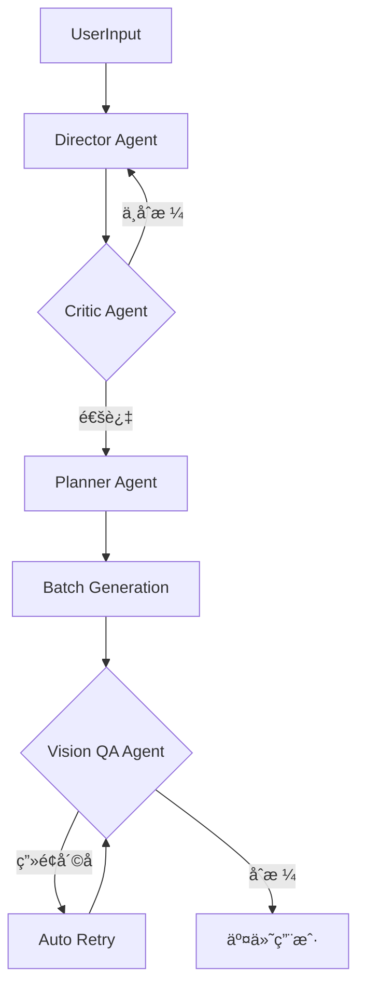

 1 +# AI-PM-Designer-Pro èåˆæ–¹æ¡ˆï¼ˆä¼˜åŒ–版）


       2
       3  ## 项目背景


       4
       5 -å°† AI-PM-Designer-Pro-main 项目的优秀功能借鉴èåˆåˆ°ç°æœ‰çš„ ecommerce-image-generator 系统中，å¢å¼ºç³»ç»Ÿçš„è¥é”€èƒ½åŠ›ã€‚


       5 +å°† AI-PM-Designer-Pro 的优秀功能èåˆåˆ° ecommerce-image-generator 系统，å¢å¼ºè¥é”€èƒ½åŠ›ã€‚


       6
       7 -## å¾…èåˆçš„核心功能


       7 +## 核心功能


       8
       9  1. **两阶段è¥é”€å·¥ä½œæµ**（策略制定 → 内容执行）


      10 -2. **智能颜色å‚考系统**（Canvas API æå–主色调）


      11 -3. **内容审阅编辑模å¼**（生æˆå‰å¯ç¼–辑ä¼åˆ’）


      12 -4. **AIDA è¥é”€æ¼æ–—模å‹**（8张图故事化æµç¨‹ï¼‰


      10 +2. **智能颜色æå–**（Canvas API æå–主色调，内置äºå·¥ä½œæµï¼‰


      11 +3. **内容审阅编辑**（生æˆå‰å¯ç¼–辑ä¼åˆ’）


      12 +4. **AIDA è¥é”€æ¼æ–—**（8张图故事化æµç¨‹ï¼‰


      13
      14 -## èåˆæ–¹å¼æ·±åº¦å¯¹æ¯”分æ


      14 +---
      15
      16 -ç»è¿‡ Plan agent 的详细评估，三ç§æ–¹å¼çš„对比如下：


      16 +## åŸæ–¹æ¡ˆé—®é¢˜åˆ†æ


      17
      18 -### æ–¹å¼ä¸€ï¼šåŠŸèƒ½å¢å¼ºå¼ â­â­â­â­â­ (最终æ¨è)


      18 +### ⌠æ¶æ„太分散


      19 +- æ–°å¢ 4 个独立 Store（colorReferenceStore, marketingStrategyStore, aidaContentStore, marketingSuiteStore）


      20 +- 状æ€ç®¡ç†ç¢ç‰‡åŒ–，维护æˆæœ¬é«˜


      21
      22 -**核心æ€è·¯**：ä¿æŒç°æœ‰ Vue + Pinia æ¶æ„，将新功能作为模å—集æˆåˆ°é«˜çº§æ¨¡å¼


      22 +### ⌠UI èåˆç”Ÿç¡¬


      23 +- 把两阶段工作æµå¡è¿› AdvancedPage çš„ Tab 3


      24 +- ä¸"èåˆ"ã€"一致性"功能并列ä¸å调（å‰è€…是å•å›¾å¢å¼ºï¼Œå者是完整工作æµï¼‰


      25
      26 -**æ¶æ„å¯è¡Œæ€§éªŒè¯**：✅ **高度å¯è¡Œ**


      27 -- 两个系统都基äºç»„件化设计和类似的状æ€ç®¡ç†æ¨¡å¼


      28 -- 技术栈一致（TypeScriptã€Gemini APIã€åˆ†å±‚æ示è¯ï¼‰


      29 -- ç°æœ‰ç³»ç»Ÿçš„ PromptBuilderã€Store æ¶æ„已预留扩展空间


      26 +### ⌠破å设计ç†å¿µ


      27 +- AI-PM-Designer 的核心价值是**完整的两阶段工作æµ**


      28 +- 强行拆分会丢失其设计优势


      29
      30 -**优势**：

      31 -- ✅ **é£é™©æœ€ä½**：ä¸ç ´åç°æœ‰åŠŸèƒ½ï¼Œæ¸è¿›å¼å¼€å‘


      32 -- ✅ **利用ç°æœ‰åŸºç¡€**：充分å¤ç”¨10层æ示è¯ç³»ç»Ÿã€åŒAPI引æ“ã€æ™ºèƒ½æ¨è


      33 -- ✅ **符åˆåˆ†é˜¶æ®µå®æ–½**：å¯ä»¥é€ä¸ªåŠŸèƒ½è¿­ä»£ï¼Œæ¯ä¸ªé˜¶æ®µç‹¬ç«‹å¯ç”¨


      34 -- ✅ **å¼€å‘效ç‡é«˜**：å¤ç”¨å¤§é‡ç°æœ‰ä»£ç å’ŒæœåŠ¡


      35 -- ✅ **功能ååŒå¼º**：å¯ä¸ç°æœ‰èåˆã€ä¸€è‡´æ€§ç³»ç»Ÿç»„åˆä½¿ç”¨


      36 -- ✅ **用户体验优秀**：统一界é¢ï¼Œå…±äº«æ•°æ®ï¼Œæ— éœ€åˆ‡æ¢æ¨¡å—


      37 -- ✅ **长期价值高**：系统整体å‡çº§ï¼Œè€Œé功能孤岛


      30 +---
      31
      32 -**劣势åŠè§£å†³æ–¹æ¡ˆ**：


      33 -- âš ï¸ **功能臃肿é£é™©**


      34 -  - 解决：é‡æ–°ç»„织高级模å¼æ ‡ç­¾é¡µï¼Œé‡‡ç”¨æ¸è¿›å¼æŠ«éœ²è®¾è®¡


      35 -- âš ï¸ **UI组织挑战**


      36 -  - 解决：独立的è¥é”€ç­–略页é¢ï¼Œæ¸…晰的进度指示器


      37 -- âš ï¸ **功能é‡å **


      38 -  - 解决：将ç°æœ‰è¥é”€å¥—图å‡çº§ä¸ºä¸¤é˜¶æ®µå·¥ä½œæµï¼Œè€Œéæ–°å¢


      32 +## 优化方案：工作æµç»Ÿä¸€å¼ â­â­â­â­â­


      33
      34 +### 核心æ€è·¯


      35 +
      36 +
**ä¸æ˜¯"功能å¢å¼º"，而是作为独立的第三ç§æ¨¡å¼ï¼šAgentic Creative Workflow (智能创æ„工作æµ)**

**核心å‡çº§**：ä»çº¿æ€§çš„ "A -> B -> C" 进化为带å馈的 "A <-> B -> C (QA)" é—­ç¯ç³»ç»Ÿã€‚


      37 +
      38  **优化åçš„æ¶æ„设计**：


      39
      40  #### 关键优化点 1：æ示è¯æ¶æ„扩展


â— Updated plan
  ⿠ /plan to preview
       35
       36  **ä¸æ˜¯"功能å¢å¼º"，而是作为独立的第三ç§æ¨¡å¼**


       37
       38 +```
       39 +模å¼åˆ‡æ¢å¯¼èˆªï¼š


       40 +┌──────────────────────────────────────────────────â”
       41 +│  [🚀 快速生æˆ]  [âš™ï¸ é«˜çº§æ¨¡å¼]  [📊 è¥é”€ä¼åˆ’]  │


       42 +└──────────────────────────────────────────────────┘
       43 +
       44 +å¿«é€Ÿç”Ÿæˆ = å•å›¾å¿«é€Ÿå‡ºå›¾ï¼ˆç°æœ‰ï¼‰


       45 +é«˜çº§æ¨¡å¼ = å•å›¾é«˜çº§æ§åˆ¶ï¼ˆç°æœ‰ï¼šèåˆã€ä¸€è‡´æ€§ï¼‰


       46 +è¥é”€ä¼åˆ’ = 套图完整工作æµï¼ˆæ–°å¢ï¼šç­–略→ä¼åˆ’→批é‡ç”Ÿæˆï¼‰


       47 +```
```
       48 +
       49 +### æ¶æ„优势


       50 +
       51 +| 对比项 | åŸæ–¹æ¡ˆ | 优化方案 |
       52 +|--------|--------|----------|
       53 +| æ–°å¢ Store | 4 个 | **1 个** |
       54 +| UI ä½ç½® | å¡è¿›é«˜çº§æ¨¡å¼ Tab 3 | **独立第三模å¼** |
       55 +| 颜色æå– | 独立功能 | **内置äºå·¥ä½œæµ** |
       56 +| 用户认知 | åŠŸèƒ½æ··æ‚ | **清晰分离** |
       57 +| å¼€å‘å¤æ‚度 | 高（多处改动） | **ä½ï¼ˆç‹¬ç«‹å¼€å‘）** |
       58 +
### 1. 核心æ¶æ„：Agentic Loop 模å¼

引入 **Critic (批评家)** å’Œ **Vision QA (视觉质检)** 两个关键å馈ç¯ã€‚



### 2. Store 设计：å•ä¸€ Store æ•´åˆæ‰€æœ‰çŠ¶æ€

```typescript
// src/stores/marketingWorkflowStore.ts

// 状æ€æµè½¬ (æ–°å¢ CRITIQUE å’Œ QA 状æ€)
IDLE → ANALYZING → CRITIQUING → STRATEGY_READY → PLANNING → GENERATING → QUALITY_CHECK → COMPLETED

// 核心状æ€
interface MarketingWorkflowState {
  currentStep: WorkflowStep
  
  // Agent æ€è€ƒæ—¥å¿— (ç”¨äº UI 展示)
  thoughtLog: AgentThought[]
  
  // Phase 1 Agents
  directorOutput: DirectorOutput | null
  criticFeedback: CriticFeedback | null  // 批评æ„è§
  
  // ... Phase 2 Agents ...
}
```
       60 +
       61 +## 详细æ¶æ„设计


       62 +
       63 +#### 关键优化点 1：æ示è¯æ¶æ„扩展


       64 +
       65 +```typescript
       66 +// åªæ–°å¢ 1 个核心 Store


       67 +src/stores/marketingWorkflowStore.ts
       68 +
       69 +// 状æ€æµè½¬


       70 +IDLE → ANALYZING → STRATEGY_READY → PLANNING → PLAN_READY → GENERATING → COMPLETED
       71 +       (Step 1)     (Step 2)         (Step 3)   (Step 4)
       72 +
       73 +// 核心状æ€


       74 +interface MarketingWorkflowState {
       75 +  currentStep: WorkflowStep
       76 +
       77 +  // Step 1: 产å“分æ


       78 +  productAnalysis: ProductAnalysis | null
       79 +  extractedColors: string[]  // 颜色æå–结æœï¼ˆå†…置）


       80 +
       81 +  // Step 2: 策略选择


       82 +  marketingRoutes: MarketingRoute[]  // 3æ¡è·¯çº¿

       83 +  selectedRouteIndex: number
       84 +
       85 +  // Step 3: 内容ä¼åˆ’


       86 +  brandContext: string
       87 +  referenceCopy: string
       88 +  contentPlan: ContentPlan | null
       89 +  editedItems: ContentItem[]  // 8张图，å¯ç¼–辑


       90 +
       91 +  // Step 4: 生æˆ
       92 +  generationProgress: { current, total, status }
       93 +}
       94 +```
       95 +
       96 +### 2. æœåŠ¡æ‰©å±•ï¼šå¼•å…¥ Agents 层
**ä¸æ˜¯ç®€å•çš„ Service 调用，而是å°è£…为 Agent Class**

```typescript
src/agents/
├── core/
│   ├── BaseAgent.ts         // 定义 think(), act() æ¥å£
│   └── AgentOrchestrator.ts // 简å•çš„调度器
├── DirectorAgent.ts         // 策略制定 (å« CoT æ€è€ƒ)
├── CriticAgent.ts           // 策略审查 (Self-Correction)
├── PlannerAgent.ts          // 内容规划
└── VisionQAAgent.ts         // 视觉ä¸åˆè§„性检查
```

### 3. Gemini Client 扩展
```typescript
// geminiClient.ts - æ–°å¢ analyzeImage() ç”¨äº Vision QA
analyzeImage(image: string, prompt: string) → { pass: boolean, reason: string }
```
      104 +```
      105 +
      106 +### 3. UI 设计：步骤化工作æµ


      107 +
      108 +```
      109 +MarketingWorkflowPage.vue（独立页é¢ï¼‰


      110 +┌─────────────────────────────────────────────────â”
      111 +│ 步骤指示器                                       │


      112 +│ [1.产å“分æ] → [2.策略选择] → [3.内容ä¼åˆ’] → [4.批é‡ç”Ÿæˆ] │


      113 +├─────────────────────────────────────────────────┤
      114 +│                                                 │
      115 +│  æ ¹æ®å½“å‰æ­¥éª¤æ˜¾ç¤ºå¯¹åº”é¢æ¿                         │


      116 +│                                                 │
      117 +│  Step 1: ProductAnalysisStep.vue                │
      118 +│    - å¤ç”¨ç°æœ‰ ProductInfoSection                 │


      119 +│    - å¤ç”¨ç°æœ‰ ImageUploader                      │


      120 +│    - å“牌背景输入 + 开始分æ按钮                  │


      121 +│    - 自动æå–颜色（内置，é独立功能）              │


      122 +│                                                 │
      123 +│  Step 2: StrategySelectionStep.vue              │
      124 +│    - 3 å¼  RouteCard（路线åã€ç›®æ ‡å®¢ç¾¤ã€è§†è§‰é£æ ¼ï¼‰ │


      125 +│    - 概念海报预览（å¯é€‰ç”Ÿæˆï¼‰                     │


      126 +│    - 选择路线按钮                                │


      127 +│                                                 │
      128 +│  Step 3: ContentPlanningStep.vue                │
      129 +│    - å‚考文案输入框                              │


      130 +│    - 8 å¼  ContentItemCard（审阅模å¼ï¼‰            │


      131 +│    - æ¯å¼ å¯ç¼–辑：标题ã€æ–‡æ¡ˆã€æç¤ºè¯               │


      132 +│                                                 │
      133 +│  Step 4: BatchGenerationStep.vue                │
      134 +│    - 8 å¼  ProductionCard（生æˆæ¨¡å¼ï¼‰             │


      135 +│    - è¿›åº¦æ¡ + 状æ€æ˜¾ç¤º                           │


      136 +│    - 批é‡ä¸‹è½½ ZIP 按钮                           │


      137 +│                                                 │
      138 +└─────────────────────────────────────────────────┘
      139 +```
      140 +
      141 +### 4. æ•°æ®æµè®¾è®¡


      142 +
      143 +```
      144 +productStore (ç°æœ‰ï¼Œå…±äº«äº§å“ä¿¡æ¯)


      145 +       │
      146 +       │ è¯»å– productInfo, primaryImage
      147 +       â–¼
      148 +marketingWorkflowStore (æ–°å¢ï¼Œå”¯ä¸€æ ¸å¿ƒ)


      149 +       │
      150 +       ├─ analyzeProduct()
      151 +       │   └─ 颜色æå– + AI 分æ → 3æ¡è·¯çº¿


      152 +       │
      153 +       ├─ selectRoute(index)
      154 +       │   └─ 选择路线


      155 +       │
      156 +       ├─ generateContentPlan()
      157 +       │   └─ AI ç”Ÿæˆ 8 张图ä¼åˆ’


      158 +       │
      159 +       └─ generateAllImages()
      160 +           └─ 循ç¯è°ƒç”¨ geminiClient → 图片结æœ


      161 +       │
      162 +       â–¼
      163 +geminiClient (ç°æœ‰ï¼Œæ‰©å±• analyzeWithText)


      164 +       │
      165 +       â–¼
      166 +promptBuilder (ç°æœ‰ï¼Œæ‰©å±• MARKETING + AIDA 层)


      167 +```
      168 +
      169 +---
      170 +
      171 +## 文件å˜æ›´æ¸…å•


      172 +
      173 +### æ–°å¢æ–‡ä»¶ï¼ˆå…± 12 个）


      174 +
      175 +```
      176 +src/stores/marketingWorkflowStore.ts          # 核心 Store (~400行)

      177 +
      178 +src/components/marketing-workflow/
      179 +├── index.ts
      180 +├── MarketingWorkflowPage.vue                 # ä¸»é¡µé¢ (~150è¡Œ)


      181 +├── WorkflowStepper.vue                       # 步骤导航 (~80行)


      182 +├── steps/
      183 +│   ├── ProductAnalysisStep.vue               # Step 1 (~120行)
      184 +│   ├── StrategySelectionStep.vue             # Step 2 (~150行)
      185 +│   ├── ContentPlanningStep.vue               # Step 3 (~180行)
      186 +│   └── BatchGenerationStep.vue               # Step 4 (~150行)
      187 +├── cards/
      188 +│   ├── RouteCard.vue                         # 路线å¡ç‰‡ (~100è¡Œ)


      189 +│   └── ContentItemCard.vue                   # 内容项å¡ç‰‡ (~120è¡Œ)


      190 +└── utils/
      191 +    └── colorExtractor.ts                     # 颜色æå– (~100è¡Œ)


      192 +
      193 +src/prompts/marketingPrompts.ts               # 系统æç¤ºè¯ (~400è¡Œ)


      194 +```
      195 +
      196 +### 修改文件（共 5 个）


      197 +
      198 +```
      199 +src/App.vue                    # 添加第三ç§æ¨¡å¼åˆ‡æ¢


      200 +src/services/promptBuilder.ts  # +MARKETING 层 +AIDA 层 (~80行)

      201 +src/services/geminiClient.ts   # +analyzeWithText 方法 (~60行)

      202 +src/types/index.ts             # +è¥é”€ç›¸å…³ç±»å‹å®šä¹‰ (~50è¡Œ)


      203 +src/stores/index.ts            # 导出新 Store

      204 +```
      205 +
      206 +### å¯åˆ é™¤æ–‡ä»¶ï¼ˆç®€åŒ–æ¶æ„）


      207 +
      208 +```
      209 +src/stores/marketingStore.ts              # 被新 Store 替代


      210 +src/components/marketing/MarketingTemplates.vue  # 被新组件替代


      211 +```
      212 +
      213 +### 代ç é‡ç»Ÿè®¡


      214 +
      215 +| 类别 | æ–°å¢è¡Œæ•° |


      216 +|------|---------|
      217 +| Store | ~400 |
      225 +
      226 +---
      227 +
      228 +## 分阶段å®æ–½è®¡åˆ’


      229 +
      230 +### Phase 1: 基础æ¶æ„（2-3 天）


      231 +
      232 +**目标**：æ­å»ºæ ¸å¿ƒæ¡†æ¶


      233 +
      234 +**交付物**：


      235 +1. `marketingWorkflowStore.ts` - 状æ€ç®¡ç†éª¨æ¶


      236 +2. `geminiClient.ts` 扩展 - analyzeWithText 方法


      237 +3. `promptBuilder.ts` 扩展 - MARKETING + AIDA 层

      238 +4. `marketingPrompts.ts` - 系统æ示è¯ï¼ˆä» AI-PM-Designer è¿ç§»ï¼‰


      239 +5. ç±»å‹å®šä¹‰


      240 +
      241 +**验è¯æ ‡å‡†**：


      242 +- [ ] Store 状æ€æµè½¬æ­£ç¡®


      243 +- [ ] analyzeWithText å¯è°ƒç”¨æˆåŠŸ


      244 +- [ ] æ示è¯å±‚正确组åˆ


      245 +
      246 +### Phase 2: UI 框æ¶ï¼ˆ2-3 天）


      247 +
      248 +**目标**ï¼šå®Œæˆ UI 骨æ¶


      249 +
      250 +**交付物**：


      251 +1. `MarketingWorkflowPage.vue` - 主页é¢

      252 +2. `WorkflowStepper.vue` - 步骤导航


      253 +3. 4 个步骤组件骨æ¶


      254 +4. `App.vue` 修改 - 三模å¼åˆ‡æ¢


      255 +
      256 +**验è¯æ ‡å‡†**：


      257 +- [ ] å¯åˆ‡æ¢åˆ°è¥é”€ä¼åˆ’模å¼


      258 +- [ ] 步骤导航正确显示


      259 +- [ ] å„步骤é¢æ¿å¯åˆ‡æ¢


      260 +
      261 +### Phase 3: 功能å®ç°ï¼ˆ4-5 天）


      262 +
      263 +**目标**：完æˆå®Œæ•´å·¥ä½œæµ


      264 +
      265 +**交付物**：


      266 +1. Step 1 完整å®ç°ï¼ˆäº§å“分æ + 颜色æå–）


      267 +2. Step 2 完整å®ç°ï¼ˆç­–略选择 + 概念预览）


      268 +3. Step 3 完整å®ç°ï¼ˆå†…容ä¼åˆ’ + 审阅编辑）


      269 +4. Step 4 完整å®ç°ï¼ˆæ‰¹é‡ç”Ÿæˆ + 进度显示）


      270 +
      271 +**验è¯æ ‡å‡†**：


      272 +- [ ] 上传产å“图 → AI ç”Ÿæˆ 3 æ¡è·¯çº¿


      273 +- [ ] 选择路线 → AI ç”Ÿæˆ 8 张图ä¼åˆ’


      274 +- [ ] å¯ç¼–辑æ¯å¼ å›¾çš„标题ã€æ–‡æ¡ˆã€æ示è¯


      275 +- [ ] å¯æ‰¹é‡ç”Ÿæˆ 8 张图


      276 +
      277 +### Phase 4: 完善优化（1-2 天）


      278 +
      279 +**目标**：完善用户体验


      280 +
      281 +**交付物**：


      282 +1. 批é‡ä¸‹è½½åŠŸèƒ½ï¼ˆZIP 打包 + 智能命å）


      283 +2. 错误处ç†å’Œé‡è¯•æœºåˆ¶


      284 +3. 加载状æ€ä¼˜åŒ–


      285 +4. å“应å¼å¸ƒå±€


      286 +
      287 +**验è¯æ ‡å‡†**：


      288 +- [ ] ZIP 下载文件å正确


      289 +- [ ] å•å¼ å¤±è´¥ä¸å½±å“其他


      290 +- [ ] 加载状æ€æ¸…æ™°


      291 +
      292 +---
      293 +
      294 +## 关键技术å®ç°


      295 +
      296 +### 1. 颜色æå–（内置äºäº§å“分æ）


      297 +
      298 +```typescript
      299 +// colorExtractor.ts
      300 +export async function extractColorsFromImage(imageBase64: string): Promise<string[]> {
      301 +  // Canvas API 分æåƒç´ 


      302 +  // é‡åŒ–到 32 级


      303 +  // 跳过é€æ˜å’Œç™½è‰²


      304 +  // è¿”å›å‰ 5 个主色调 HEX


      305 +  return ['#FF5733', '#33FF57', ...]
      306 +}
      307 +```
      308 +
      309 +### 2. 系统æ示è¯ï¼ˆä» AI-PM-Designer è¿ç§»ï¼‰


      310 +
      311 +```typescript
      312 +// marketingPrompts.ts
      313 +export const DIRECTOR_SYSTEM_PROMPT = `
      314 +你是一ä½AI视觉行銷总监...


      315 +输入：产å“图片 + 产å“å称 + å“牌背景


      316 +输出：JSON { product_analysis, marketing_routes[3] }

      317 +`
      318 +
      319 +export const CONTENT_PLANNER_SYSTEM_PROMPT = `
      320 +你是一ä½èµ„深社群内容规划师...


      321 +输入：选定路线 + 产å“分æ + å‚考文案


      322 +输出：JSON { plan_name, items[8] }（AIDA 模å‹ï¼‰


      323 +`
      324 +```
      325 +
      326 +### 3. 8 张图 AIDA 结æ„


      327 +
      328 +```typescript
      329 +const AIDA_STRUCTURE = [
      330 +  { id: 'img_1', type: 'main_white',     ratio: '1:1',  stage: null },
      331 +  { id: 'img_2', type: 'main_lifestyle', ratio: '1:1',  stage: null },
      332 +  { id: 'img_3', type: 'story_hook',     ratio: '9:16', stage: 'attention' },
      333 +  { id: 'img_4', type: 'story_problem',  ratio: '9:16', stage: 'interest' },
      334 +  { id: 'img_5', type: 'story_solution', ratio: '9:16', stage: 'desire' },
      335 +  { id: 'img_6', type: 'story_features', ratio: '9:16', stage: 'desire' },
      336 +  { id: 'img_7', type: 'story_trust',    ratio: '9:16', stage: 'desire' },
      337 +  { id: 'img_8', type: 'story_cta',      ratio: '9:16', stage: 'action' },
      338 +]
      339 +```
      340 +
      341 +### 4. 智能命å规则


      342 +
      343 +```
      344 +æ ¼å¼ï¼š{type}_{ratio}_{index}_{keyword}.png

      345 +
      346 +示例：

      347 +main-white_1x1_01_product.png
      348 +main-lifestyle_1x1_02_lifestyle.png
      349 +story_9x16_03_hook.png
      350 +story_9x16_04_problem.png
      351 +story_9x16_05_solution.png
      352 +story_9x16_06_features.png
      353 +story_9x16_07_trust.png
      354 +story_9x16_08_cta.png
      355 +```
      356 +
      357 +---
      358 +
      359 +## 验è¯æ–¹æ¡ˆ


      360 +
      361 +### 端到端测试æµç¨‹


      362 +
      363 +```
      364 +1. 切æ¢åˆ°"è¥é”€ä¼åˆ’"模å¼


      365 +2. 上传产å“图片（如：智能手表）


      366 +3. 输入产å“å称和å“牌背景


      367 +4. 点击"开始分æ" → 验è¯ï¼š


      368 +   - 颜色æå–显示 5 个主色调


      369 +   - AI è¿”å› 3 æ¡å·®å¼‚化è¥é”€è·¯çº¿


      370 +5. 选择一æ¡è·¯çº¿


      371 +6. 输入å‚考文案（å¯é€‰ï¼‰


      372 +7. 点击"生æˆä¼åˆ’" → 验è¯ï¼š


      373 +   - AI è¿”å› 8 张图的完整ä¼åˆ’


      374 +   - æ¯å¼ å›¾æœ‰æ ‡é¢˜ã€æ–‡æ¡ˆã€æ示è¯


      375 +8. 编辑其中一张图的文案


      376 +9. 点击"批é‡ç”Ÿæˆ" → 验è¯ï¼š


      377 +   - 8 张图按顺åºç”Ÿæˆ


      378 +   - 进度æ¡æ­£ç¡®æ˜¾ç¤º


      379 +10. 点击"下载全部" → 验è¯ï¼š


      380 +    - ZIP 文件正确下载


      381 +    - 文件å符åˆå‘½å规则


      382 +```
      383 +
      384 +---
      385 +
      386 +## é£é™©ä¸åº”对


      387 +
      388 +| é£é™© | 缓解策略 |


      389 +|------|----------|
      390 +| AI 分æè´¨é‡ä¸ç¨³å®š | æä¾›é‡æ–°åˆ†æ按钮 + 手动编辑 |


      391 +| API 调用æˆæœ¬ | 缓存已生æˆå›¾ç‰‡ + æˆæœ¬æ示 |


      392 +| 批é‡ç”Ÿæˆé™æµ | é—´éš” 1 秒 + 失败é‡è¯• |


      393 +| 颜色æå–ä¸å‡† | UI 显示æå–ç»“æœ + å¯æ‰‹åŠ¨è°ƒæ•´ |


      394 +
      395 +---
      396 +
      397 +## 关键文件路径


      398 +
      399 +```
      400 +核心 Store：

      401 +C:\Users\14224\ecommerce-image-generator\src\stores\marketingWorkflowStore.ts
      402 +
      403 +主页é¢ï¼š


      404 +C:\Users\14224\ecommerce-image-generator\src\components\marketing-workflow\MarketingWorkflowPage.vue
      405 +
      406 +系统æ示è¯ï¼ˆå‚考æºï¼‰ï¼š


      407 +C:\Users\14224\ecommerce-image-generator\AI-PM-Designer-Pro-main\prompts.ts
      408 +
      409 +颜色æå–（å‚考æºï¼‰ï¼š


      410 +C:\Users\14224\ecommerce-image-generator\AI-PM-Designer-Pro-main\utils\imageColorExtractor.ts
      411 +
      412 +æœåŠ¡æ‰©å±•ï¼š


      413 +C:\Users\14224\ecommerce-image-generator\src\services\promptBuilder.ts
      414 +C:\Users\14224\ecommerce-image-generator\src\services\geminiClient.ts
      415 +```
      416 +
      417  **优化åçš„æ¶æ„设计**：


      418
      419  #### 关键优化点 1：æ示è¯æ¶æ„扩展


â— Updated plan
  ⿠ /plan to preview
       414  C:\Users\14224\ecommerce-image-generator\src\services\geminiClient.ts
       415  ```
       416
       417 -**优化åçš„æ¶æ„设计**：


       418 -
       419 -#### 关键优化点 1：æ示è¯æ¶æ„扩展


       420 -
       421 -**ä» 10 层扩展到 13 层** （Plan agent 建议使用 13 层而éåŸè®¡åˆ’çš„ 12 层）


       422 -
       423 -```typescript
       424 -ç°æœ‰ 10 层：


       425 -1. 核心主体 (1.5x)


       426 -2. 模特层 (1.4x)

       427 -3. èåˆå±‚ (1.4x)

       428 -4. 一致性层 (1.3x)


       429 -5. 场景上下文 (1.2x)


       430 -6. 光照层 (1.0x)

       431 -7. æ„图层 (1.0x)

       432 -8. é£æ ¼å±‚ (1.1x)

       433 -9. è´¨é‡å±‚ (1.3x)

       434 -10. 语义å¢å¼º (0.9x)


       435 -11. 细节层 (0.8x)

       436 -12. è´Ÿé¢æ示 (1.0x)


       437 -
       438 -æ–°å¢ 3 层：


       439 -13. 颜色å‚考层 (1.35x) â­ ä»äº§å“图æå–颜色


       440 -14. è¥é”€ç­–略层 (1.25x) â­ æ¥è‡ªä¸¤é˜¶æ®µå·¥ä½œæµçš„策略定义


       441 -15. AIDA 阶段层 (1.15x) â­ ä¸“ç”¨äº 8 张图的è¥é”€æ¼æ–—阶段


       442 -```
       443 -
       444 -**æƒé‡åˆ†é…ç­–ç•¥**：


       445 -- 颜色å‚考层æƒé‡ 1.35，高äºä¸€è‡´æ€§å±‚，确ä¿é¢œè‰²ä¼˜å…ˆçº§


       446 -- è¥é”€ç­–略层æƒé‡ 1.25，介äºåœºæ™¯å’ŒAIDA之间


       447 -- AIDA阶段层æƒé‡ 1.15，略高äºé£æ ¼å±‚


       448 -
       449 -#### 关键优化点 2：Store æ¶æ„é‡æ–°è®¾è®¡


       450 -
       451 -**问题**：é¿å… marketingStore 命å冲çª


       452 -
       453 -**解决方案**：é‡å‘½å + èŒè´£åˆ†ç¦»


       454 -
       455 -```typescript
       456 -src/stores/
       457 -├── marketingSuiteStore.ts (åŸ marketingStore，é‡å‘½å)


       458 -│   èŒè´£ï¼šç®¡ç†ç°æœ‰çš„è¥é”€å¥—图功能 (Amazon/Social Media 模æ¿)


       459 -│
       460 -├── marketingStrategyStore.ts â­ æ–°å¢

       461 -│   èŒè´£ï¼šPhase 1 策略制定（3æ¡è·¯çº¿ × 3张概念海报）


       462 -│
       463 -├── aidaContentStore.ts â­ æ–°å¢

       464 -│   èŒè´£ï¼šPhase 2 内容ä¼åˆ’（8张图 AIDA æµç¨‹ï¼‰


       465 -│
       466 -├── colorReferenceStore.ts â­ æ–°å¢

       467 -│   èŒè´£ï¼šé¢œè‰²æå–和颜色å‚考管ç†


       468 -│
       469 -└── index.ts (修改：添加å‘å兼容的别å导出)


       470 -    export { useMarketingSuiteStore as useMarketingStore }
       471 -```
       472 -
       473 -#### 关键优化点 3：API 能力扩展


       474 -
       475 -修改 `geminiClient.ts`，新å¢æ–‡æœ¬åˆ†æ能力：


       476 -
       477 -```typescript
       478 -æ–°å¢æ–¹æ³•ï¼š


       479 -- analyzeText(): 支æŒç³»ç»Ÿæç¤ºè¯ + 用户æç¤ºè¯ + å¯é€‰å›¾ç‰‡


       480 -- parseTextResponse(): 智能解æ JSON å“应


       481 -- 支æŒåŒå议（Google Native + OpenRouter）


       482 -```
       483 -
       484 -#### 文件结æ„


       485 -```
       486 -ç°æœ‰æ¶æ„ä¿æŒä¸å˜ï¼Œæ–°å¢å…³é”®æ¨¡å—：


       487 -src/
       488 -├── components/
       489 -│   ├── marketing-strategy/ (æ–°å¢ç›®å½•)


       490 -│   │   ├── ProductBrandInput.vue (产å“+å“牌输入)


       491 -│   │   ├── RouteSelection.vue (3æ¡è·¯çº¿é€‰æ‹©)


       492 -│   │   └── ConceptGallery.vue (概念海报展示)


       493 -│   ├── aida-content/ (æ–°å¢ç›®å½•)


       494 -│   │   ├── ContentPlanInput.vue (å‚考文案输入)


       495 -│   │   ├── ContentItemEditor.vue (å•å¼ å›¾ç¼–辑器)


       496 -│   │   └── AidaContentPanel.vue (主é¢æ¿)

       497 -│   └── product/
       498 -│       └── ImageUploader.vue (å¢å¼ºï¼šé¢œè‰²é¢„览UI)


       499 -├── stores/
       500 -│   ├── marketingSuiteStore.ts (é‡å‘½å)

       501 -│   ├── marketingStrategyStore.ts (æ–°å¢)
       502 -│   ├── aidaContentStore.ts (æ–°å¢)
       503 -│   └── colorReferenceStore.ts (æ–°å¢)
       504 -├── services/
       505 -│   ├── colorExtractionService.ts (æ–°å¢)
       506 -│   ├── promptBuilder.ts (扩展：+3层)


       507 -│   └── geminiClient.ts (扩展：+analyzeText)

       508 -├── pages/
       509 -│   └── MarketingStrategyPage.vue (æ–°å¢ï¼šç‹¬ç«‹é¡µé¢)


       510 -├── composables/
       511 -│   └── useImageUpload.ts (å¢å¼ºï¼šé¢œè‰²æå–)


       512 -└── types/
       513 -    ├── color.ts (æ–°å¢)
       514 -    └── marketing-strategy.ts (æ–°å¢)
       515 -```
       516 -
       517 -**UI组织方案**：


       518 -```
       519 -AdvancedPage (高级模å¼)


       520 -├── Tab 1: 基础é…ç½®


       521 -│   ├── 产å“ä¿¡æ¯ + 上传


       522 -│   ├── 场景选择


       523 -│   └── 模特é…ç½®


       524 -├── Tab 2: 高级特性


       525 -│   ├── 多图èåˆ


       526 -│   └── 一致性系统


       527 -└── Tab 3: è¥é”€ä¼åˆ’ (改造)


       528 -    ├── 工作æµé€‰æ‹©ï¼š


       529 -    │   ├── 快速套图（ç°æœ‰æ¨¡æ¿ï¼šAmazon/Social Media）


       530 -    │   └── 智能策略（新å¢ï¼šä¸¤é˜¶æ®µ+AIDA）


       531 -    └── [æ¡ä»¶æ˜¾ç¤º]


       532 -        ├── 策略制定阶段（Phase 1）


       533 -        └── 内容审阅阶段（Phase 2）


       534 -```
       535 -
       536 -### æ–¹å¼äºŒï¼šæ·±åº¦é‡æ„å¼ â­â­â­


       537 -
       538 -**核心æ€è·¯**：借鉴 AI-PM-Designer 的工作æµç†å¿µï¼Œé‡æ–°è®¾è®¡ç”¨æˆ·äº¤äº’æµç¨‹


       539 -
       540 -**优势**：

       541 -- ✅ **解决ç°æœ‰ç—›ç‚¹**：彻底解决快速/高级模å¼çš„用户体验割裂


       542 -- ✅ **统一工作æµ**：一套完整的è¥é”€ç”Ÿå›¾æµç¨‹


       543 -- ✅ **产å“æ€è·¯ä¼˜åŒ–**：更符åˆAI-PM-Designer的优秀设计ç†å¿µ


       544 -
       545 -**劣势**：

       546 -- ⌠**高é£é™©**：å¯èƒ½ç ´åç°æœ‰åŠŸèƒ½


       547 -- ⌠**å¼€å‘周期长**：需è¦é‡æ„大é‡ç»„件


       548 -- ⌠**测试æˆæœ¬é«˜**：所有功能需è¦é‡æ–°æµ‹è¯•


       549 -- ⌠**ä¸ç¬¦åˆåˆ†é˜¶æ®µå®æ–½**：需è¦ä¸€æ¬¡æ€§å¤§è§„模改动


       550 -- ⌠**å½±å“ç°æœ‰ç”¨æˆ·**：改å˜ç”¨æˆ·ä¹ æƒ¯


       551 -
       552 -**æ¶æ„设计**：


       553 -```
       554 -需è¦é‡æ„的范围：


       555 -- é‡æ–°è®¾è®¡é¡µé¢è·¯ç”±ï¼ˆç»Ÿä¸€æ¨¡å¼ï¼‰


       556 -- é‡æ„ AdvancedPage å’Œ QuickPage

       557 -- é‡æ–°ç»„织所有功能模å—


       558 -- å¯èƒ½å½±å“10+个Store


       559 -- å¯èƒ½å½±å“30+个组件


       560 -```
       561 -
       562 -**评估**：ä¸æ¨è作为首选方案，é£é™©è¿‡é«˜ä¸”ä¸ç¬¦åˆåˆ†é˜¶æ®µå®æ–½è¦æ±‚。


       563 -
       564 -### æ–¹å¼ä¸‰ï¼šç‹¬ç«‹æ¨¡å—å¼ â­â­â­â­


       565 -
       566 -**核心æ€è·¯**：将 AI-PM-Designer 功能作为独立的第三个模å¼


       567 -
       568 -**优势**：

       569 -- ✅ **功能隔离**：互ä¸å½±å“，开å‘和测试独立


       570 -- ✅ **é£é™©å¯æ§**：ä¸ä¼šç ´åç°æœ‰åŠŸèƒ½


       571 -- ✅ **用户选择çµæ´»**：å¯ä»¥æŒ‰åœºæ™¯é€‰æ‹©ä¸åŒæ¨¡å¼


       572 -
       573 -**劣势**：

       574 -- âš ï¸ **用户困惑**：三个模å¼ï¼ˆå¿«é€Ÿ/高级/è¥é”€ç­–略）选择æˆæœ¬é«˜


       575 -- âš ï¸ **代ç é‡å¤**：æ示è¯æ„建ã€API调用等逻辑å¯èƒ½é‡å¤


       576 -- âš ï¸ **资æºæµªè´¹**：无法充分利用ç°æœ‰åŸºç¡€è®¾æ–½ï¼ˆ10层æ示è¯ç³»ç»Ÿã€åŒå¼•æ“等）


       577 -- âš ï¸ **维护æˆæœ¬é«˜**：三套独立系统需è¦åˆ†åˆ«ç»´æŠ¤


       578 -
       579 -**æ¶æ„设计**：


       580 -```
       581 -æ–°å¢è·¯ç”±é¡µé¢ï¼š


       582 -src/
       583 -├── components/
       584 -│   └── pages/
       585 -│       ├── QuickPage.vue (ç°æœ‰)
       586 -│       ├── AdvancedPage.vue (ç°æœ‰)
       587 -│       └── MarketingStrategyPage.vue (æ–°å¢ï¼šå®Œæ•´çš„AI-PM-Designer工作æµ)


       588 -└── stores/
       589 -    └── marketingStrategyStore.ts (æ–°å¢ï¼šå®Œå…¨ç‹¬ç«‹çš„Store)


       590 -```
       591 -
       592 -**评估**：中等æ¨è，适åˆä½œä¸ºå¤‡é€‰æ–¹æ¡ˆã€‚如æœåŠŸèƒ½å¢å¼ºå¼é‡åˆ°ä¸¥é‡çš„UI组织问题，å¯ä»¥è€ƒè™‘此方案。


       593 -
       417  ---
       418
       419 -## 最终æ¨è方案：功能å¢å¼ºå¼ + æ¶æ„优化


       419 +## 总结对比


       420
       421 -### 核心策略


       421 +| 维度 | åŸæ–¹æ¡ˆï¼ˆåˆ†æ•£å¼ï¼‰ | 优化方案（统一å¼ï¼‰ |


       422 +|------|------------------|-------------------|
       423 +| **Store æ•°é‡** | 4 个新 Store | **1 个新 Store** |


       424 +| **UI ä½ç½®** | å¡è¿›é«˜çº§æ¨¡å¼ Tab 3 | **独立第三模å¼** |


       425 +| **颜色æå–** | ç‹¬ç«‹åŠŸèƒ½æ¨¡å— | **内置äºå·¥ä½œæµ** |


       426 +| **代ç é‡** | ~4,151 è¡Œ | **~2,140 è¡Œ** |


       427 +| **å¼€å‘周期** | 5-7 周 | **2-3 周** |


       428 +| **用户认知** | åŠŸèƒ½æ··æ‚ | **清晰分离** |


       429 +| **å¤ç”¨ç¨‹åº¦** | 中等 | **高** |


       430
       431 -1. **ä¿æŒç°æœ‰æ¶æ„**：Vue 3 + Pinia + TypeScript


       432 -2. **改造而éæ–°å¢**：将ç°æœ‰çš„è¥é”€å¥—图功能å‡çº§ä¸ºä¸¤é˜¶æ®µå·¥ä½œæµ


       433 -3. **充分å¤ç”¨**：利用10层æ示è¯ç³»ç»Ÿã€åŒå¼•æ“ã€æ™ºèƒ½æ¨è等基础设施


       434 -4. **æ¸è¿›å¼é›†æˆ**：分3个阶段å®æ–½ï¼Œæ¯ä¸ªé˜¶æ®µç‹¬ç«‹å¯ç”¨


       431 +## 下一步

       432
       433 -### 关键设计决策


       434 -
       435 -#### 1. 解决功能é‡å é—®é¢˜


       436 -
       437 -**ç°çŠ¶**：

       438 -- ç°æœ‰ç³»ç»Ÿæœ‰ `marketingStore` å’Œ `MarketingTemplates` 组件


       439 -- æ”¯æŒ Amazon å’Œ Social Media 两个模æ¿


       440 -- æ¯ä¸ªæ¨¡æ¿æœ‰å›ºå®šçš„Sloté…ç½®


       441 -
       442 -**改造方案**：


       443 -```
       444 -ç°æœ‰è¥é”€å¥—图 → å‡çº§ä¸ºä¸¤é˜¶æ®µæ™ºèƒ½è¥é”€ä¼åˆ’


       445 -
       446 -Phase 1: 策略制定（新å¢ï¼‰


       447 -- 用户输入：产å“ä¿¡æ¯ + å¯é€‰çš„å“牌背景


       448 -- AI分æ：生æˆ3æ¡å·®å¼‚化è¥é”€è·¯çº¿


       449 -- æ¯æ¡è·¯çº¿ï¼š3张概念海报预览


       450 -- 用户选择：选定一æ¡è·¯çº¿è¿›å…¥Phase 2


       451 -
       452 -Phase 2: 内容ä¼åˆ’（改造ç°æœ‰æ¨¡æ¿ï¼‰


       453 -- AI生æˆï¼š8张图的完整ä¼åˆ’（标题+文案+æ示è¯ï¼‰


       454 -- 审阅编辑：用户å¯é€å¼ ç¼–辑内容


       455 -- 批é‡ç”Ÿæˆï¼šç”Ÿæˆæœ€ç»ˆé«˜è´¨é‡å›¾ç‰‡


       456 -- 智能命å：按 {type}_{ratio}_{index}_{keyword}.png æ ¼å¼


       457 -```
       458 -
       459 -#### 2. UI组织方案


       460 -
       461 -**高级模å¼æ ‡ç­¾é¡µé‡ç»„**：


       462 -```
       463 -Tab 1: 产å“é…ç½®


       464 -├── 产å“ä¿¡æ¯å’Œå›¾ç‰‡ä¸Šä¼ ï¼ˆå¢å¼ºï¼šæ˜¾ç¤ºæå–的颜色）


       465 -├── 场景选择（ä¿æŒä¸å˜ï¼‰


       466 -└── 模特é…置（ä¿æŒä¸å˜ï¼‰


       467 -
       468 -Tab 2: 生æˆé€‰é¡¹


       469 -├── 多图èåˆï¼ˆä¿æŒä¸å˜ï¼‰


       470 -├── 一致性系统（ä¿æŒä¸å˜ï¼‰


       471 -└── 生æˆè®¾ç½®ï¼ˆä¿æŒä¸å˜ï¼‰


       472 -
       473 -Tab 3: è¥é”€ä¼åˆ’（改造）


       474 -├── 工作æµåˆ‡æ¢ï¼š


       475 -│   ├── [ ] 简å•æ¨¡æ¿ï¼ˆä¿ç•™ç°æœ‰çš„Amazon/Social Media）


       476 -│   └── [x] 智能策略（新å¢ï¼šä¸¤é˜¶æ®µ+AIDA）


       477 -│
       478 -├── [当选择"智能策略"时]


       479 -│   ├── å“牌背景输入（å¯é€‰ï¼‰


       480 -│   ├── 开始策略制定按钮


       481 -│   │
       482 -│   └── [Phase 1: 策略制定结æœ]


       483 -│       ├── 产å“分æ概览


       484 -│       ├── 3æ¡è¥é”€è·¯çº¿å¡ç‰‡


       485 -│       │   ├── 路线å称 + 目标客群


       486 -│       │   ├── 主标题 + 副标题


       487 -│       │   ├── 视觉é£æ ¼æè¿°


       488 -│       │   └── 3张概念海报（å¯ç”Ÿæˆï¼‰


       489 -│       └── 选择路线 → 进入Phase 2


       490 -│
       491 -└── [Phase 2: 内容审阅编辑]


       492 -    ├── 8张图的ä¼åˆ’列表：


       493 -    │   ├── img_1_white: 商å“白底图 (1:1)


       494 -    │   ├── img_2_lifestyle: 场景主视觉 (1:1)


       495 -    │   ├── img_3_hook: Hook - Attention (9:16)
       496 -    │   ├── img_4_problem: Problem - Interest (9:16)
       497 -    │   ├── img_5_solution: Solution - Desire (9:16)
       498 -    │   ├── img_6_features: Features - Desire (9:16)
       499 -    │   ├── img_7_trust: Trust - Desire (9:16)
       500 -    │   └── img_8_cta: CTA - Action (9:16)
       501 -    │
       502 -    ├── æ¯ä¸ªæ¡ç›®å¯ç¼–辑：


       503 -    │   ├── 标题（title_zh）


       504 -    │   ├── 文案（copy_zh）


       505 -    │   └── AIæ示è¯ï¼ˆvisual_prompt_en）


       506 -    │
       507 -    └── 生æˆæ§åˆ¶ï¼š


       508 -        ├── é€å¼ ç”Ÿæˆï¼ˆæ”¯æŒå‚考图片上传）


       509 -        └── 批é‡ä¸‹è½½ï¼ˆZIP打包 + 智能命å）


       510 -```
       511 -
       512 -#### 3. æ•°æ®æµè®¾è®¡


       513 -
       514 -```
       515 -用户æ“作æµç¨‹ï¼š


       516 -
       517 -1. 基础é…ç½®


       518 -   产å“ä¿¡æ¯ â†’ productStore


       519 -   产å“图片 → useImageUpload → colorExtractionService


       520 -   æå–颜色 → ä¿å­˜åˆ° productStore.extractedColors


       521 -
       522 -2. 策略制定（Phase 1）


       523 -   输入å“牌背景 → marketingStrategyStore.brandContext


       524 -   点击"开始策略制定" → marketingStrategyStore.startStrategyPhase()


       525 -      ↓
       526 -   调用 geminiClient (Gemini 2.5 Flash)
       527 -   使用 DIRECTOR_SYSTEM_PROMPT（ä»AI-PM-Designer移æ¤ï¼‰


       528 -      ↓
       529 -   è¿”å› DirectorOutput：

       530 -      - product_analysis
       531 -      - marketing_routes[3]
       532 -         - route_name, headline_zh, subhead_zh
       533 -         - style_brief_zh, target_audience_zh
       534 -         - image_prompts[3]
       535 -      ↓
       536 -   ä¿å­˜åˆ° marketingStrategyStore.directorOutput

       537 -   状æ€åˆ‡æ¢åˆ° STRATEGY_READY


       538 -
       539 -3. 概念海报生æˆï¼ˆPhase 1）


       540 -   用户点击"生æˆ"按钮 → 调用 geminiClient (Gemini 3 Pro Image)


       541 -   使用 image_prompts[i]
       542 -   应用颜色å‚考（如æœæœ‰ï¼‰


       543 -      ↓
       544 -   显示概念海报预览


       545 -
       546 -4. 选择路线（Phase 1 → Phase 2）


       547 -   用户选择一æ¡è·¯çº¿ → marketingStrategyStore.selectRoute(index)


       548 -   点击"生æˆå†…容ä¼åˆ’" → marketingStrategyStore.startContentPhase()


       549 -      ↓
       550 -   调用 geminiClient (Gemini 2.5 Flash + Thinking)
       551 -   使用 CONTENT_PLANNER_SYSTEM_PROMPT（ä»AI-PM-Designer移æ¤ï¼‰


       552 -   输入：选定的路线 + 产å“ä¿¡æ¯ + å“牌背景


       553 -      ↓
       554 -   è¿”å› ContentPlan：

       555 -      - plan_name
       556 -      - items[8]
       557 -         - id, type, title_zh, copy_zh
       558 -         - visual_prompt_en, aspect_ratio
       559 -      ↓
       560 -   ä¿å­˜åˆ° marketingStrategyStore.contentPlan

       561 -   状æ€åˆ‡æ¢åˆ° CONTENT_READY


       562 -
       563 -5. 内容审阅编辑（Phase 2）


       564 -   用户编辑æ¯ä¸ªitem → marketingStrategyStore.updateContentItem(id, field, value)


       565 -
       566 -6. 最终图片生æˆï¼ˆPhase 2）


       567 -   é€å¼ ç”Ÿæˆ → 调用 generationStore.generate()


       568 -      ↓
       569 -   æ„建æ示è¯ï¼š


       570 -      - 基础：10层æ示è¯æ¶æ„（ç°æœ‰ï¼‰


       571 -      - èåˆï¼šå¤šå›¾èåˆé…置（如æœå¯ç”¨ï¼‰


       572 -      - 一致性：一致性系统é…置（如æœå¯ç”¨ï¼‰


       573 -      - è¥é”€å±‚：visual_prompt_en + title_zh + copy_zh (æ–°å¢)


       574 -      - 颜色层：extractedColors（新å¢ï¼‰


       575 -      - AIDA层：根æ®type添加AIDA相关指令（新å¢ï¼‰


       576 -      ↓
       577 -   调用 geminiClient (Gemini 3 Pro Image)
       578 -      ↓
       579 -   ä¿å­˜ç»“æœåˆ° generationStore.results


       580 -   应用智能命å规则


       581 -
       582 -7. 批é‡ä¸‹è½½


       583 -   调用 marketingStrategyStore.downloadAllImages()
       584 -   使用 JSZip 打包


       585 -   应用智能命å：{type}_{ratio}_{index}_{keyword}.png


       586 -```
       587 -
       588 ----
       589 -
       590 -## 分阶段å®æ–½è®¡åˆ’（详细）


       591 -
       592 -### 第一阶段：智能颜色å‚考系统（1-2周）


       593 -
       594 -**目标**：å®ç°é¢œè‰²æå–和颜色优先å‚考功能


       595 -
       596 -**预估工作é‡**：5-8个工作日


       597 -
       598 -#### 文件修改清å•


       599 -
       600 -| 文件路径 | æ“作 | 代ç é‡ | è¯´æ˜ |


       601 -|---------|------|--------|------|
       602 -| `src/stores/colorReferenceStore.ts` | æ–°å¢ | ~120è¡Œ | 颜色管ç†æ ¸å¿ƒStore |


       603 -| `src/utils/imageColorExtractor.ts` | æ–°å¢ | ~180è¡Œ | ä»AI-PM-Designerç§»æ¤ |


       604 -| `src/types/color.ts` | æ–°å¢ | ~20è¡Œ | 颜色相关类å‹å®šä¹‰ |


       605 -| `src/composables/useImageUpload.ts` | 修改 | +30è¡Œ | 集æˆé¢œè‰²æå–è§¦å‘ |


       606 -| `src/services/promptBuilder.ts` | 修改 | +50è¡Œ | æ–°å¢é¢œè‰²å‚考层 |


       607 -| `src/components/product/ImageUploader.vue` | 修改 | +80行 | 颜色预览UI |


       608 -| `src/types/index.ts` | 修改 | +15è¡Œ | å¯¼å‡ºé¢œè‰²ç±»å‹ |


       609 -
       610 -**总计**：约 495 行新å¢/修改代ç 


       611 -
       612 -#### 关键技术å®ç°


       613 -
       614 -**1. 颜色æå–算法** (`imageColorExtractor.ts`)


       615 -```typescript
       616 -核心功能：


       617 -- Canvas API 分æåƒç´ æ•°æ®


       618 -- 颜色é‡åŒ–到32级（å‡å°‘颜色空间）


       619 -- 跳过é€æ˜å’Œç™½è‰²åƒç´ 


       620 -- 统计颜色频ç‡å¹¶æ’åº


       621 -- è¿”å›å‰5个主è¦é¢œè‰²


       622 -
       623 -输出格å¼ï¼š


       624 -{
       625 -  dominantColors: ['#FF5733', '#33FF57', ...],
       626 -  colorPalette: ['rgb(255,87,51)', ...],
       627 -  description: '以暖橙色和绿色为主'


       628 -}
       629 -```
       630 -
       631 -**2. colorReferenceStore 核心方法**


       632 -```typescript
       633 -- extractColorsFromImage(imageId, dataUrl): æå–颜色


       634 -- setPreferredColorSource(imageId): 设置优先颜色æ¥æº


       635 -- currentColorPrompt: 计算å±æ€§ï¼Œç”Ÿæˆé¢œè‰²æ示è¯ç‰‡æ®µ


       636 -- toggleEnabled(): å¯ç”¨/ç¦ç”¨é¢œè‰²å‚考


       637 -```
       638 -
       639 -**3. promptBuilder 集æˆ**
       640 -```typescript
       641 -æ–°å¢å±‚级：


       642 -PromptLayerType.COLOR_REFERENCE (æƒé‡ 1.35)
       643 -
       644 -æ示è¯ç‰‡æ®µç¤ºä¾‹ï¼š


       645 -"Use the following color palette: #FF5733, #33FF57, #5733FF.
       646 - Ensure the product prominently features these colors."
       647 -```
       648 -
       649 -#### 功能验è¯æ ‡å‡†


       650 -
       651 -- [x] **æå–准确性**：上传产å“图片å自动æå–é¢œè‰²ï¼Œå‡†ç¡®ç‡ > 80%


       652 -- [x] **UI 显示**：颜色以色å—å½¢å¼æ˜¾ç¤ºï¼Œå¯ç‚¹å‡»åˆ‡æ¢ä¼˜å…ˆæ¥æº


       653 -- [x] **æ示è¯é›†æˆ**：生æˆæ—¶é¢œè‰²ä¿¡æ¯æ­£ç¡®èå…¥æ示è¯ï¼ˆæ£€æŸ¥æœ€ç»ˆæ示è¯ï¼‰


       654 -- [x] **生æˆæ•ˆæœ**：生æˆçš„图片色调ä¸æå–颜色匹é…（人工评估）


       655 -- [x] **开关æ§åˆ¶**：ç¦ç”¨é¢œè‰²å‚考å，æ示è¯ä¸­ä¸åŒ…å«é¢œè‰²ä¿¡æ¯


       656 -- [x] **性能**：颜色æå–时间 < 500ms


       657 -
       658 -#### 测试用例


       659 -
       660 -1. **é€æ˜PNG测试**：上传é€æ˜èƒŒæ™¯çš„产å“图，验è¯è·³è¿‡é€æ˜åƒç´ 


       661 -2. **白底图测试**：上传白底产å“图，验è¯è·³è¿‡ç™½è‰²åƒç´ 


       662 -3. **多图测试**：上传3张产å“图，验è¯å¯åˆ‡æ¢ä¼˜å…ˆé¢œè‰²æ¥æº


       663 -4. **生æˆæµ‹è¯•**：


       664 -   - å¯ç”¨é¢œè‰²å‚考生æˆ1张图


       665 -   - ç¦ç”¨é¢œè‰²å‚考生æˆ1张图


       666 -   - 对比色调差异


       667 -
       668 -### 第二阶段：两阶段è¥é”€å·¥ä½œæµï¼ˆ2-3周）


       669 -
       670 -**目标**：å®ç° Phase 1 策略制定（3æ¡è·¯çº¿ × 3张概念海报）


       671 -
       672 -**预估工作é‡**：10-15个工作日


       673 -
       674 -#### 文件修改清å•


       675 -
       676 -| 文件路径 | æ“作 | 代ç é‡ | è¯´æ˜ |


       677 -|---------|------|--------|------|
       678 -| `src/stores/marketingStrategyStore.ts` | æ–°å¢ | ~400è¡Œ | 策略工作æµæ ¸å¿ƒStore |


       679 -| `src/stores/marketingSuiteStore.ts` | é‡å‘½å | 0è¡Œ | åŸ marketingStore.ts é‡å‘½å |


       680 -| `src/stores/index.ts` | 修改 | +5è¡Œ | 添加别å导出确ä¿å‘å兼容 |


       681 -| `src/services/geminiClient.ts` | 修改 | +200è¡Œ | æ–°å¢ analyzeText 方法 |


       682 -| `src/services/promptBuilder.ts` | 修改 | +80è¡Œ | æ–°å¢è¥é”€ç­–略层 |


       683 -| `src/prompts/marketingPrompts.ts` | æ–°å¢ | ~400è¡Œ | 移æ¤ç³»ç»Ÿæç¤ºè¯ |


       684 -| `src/types/marketing-strategy.ts` | æ–°å¢ | ~100è¡Œ | ç±»å‹å®šä¹‰ |


       685 -| `src/components/marketing-strategy/ProductBrandInput.vue` | æ–°å¢ | ~120è¡Œ | 产å“+å“牌输入UI |


       686 -| `src/components/marketing-strategy/RouteSelection.vue` | æ–°å¢ | ~180è¡Œ | 路线选择UI |


       687 -| `src/components/marketing-strategy/ConceptGallery.vue` | æ–°å¢ | ~150è¡Œ | 概念海报展示UI |


       688 -| `src/pages/MarketingStrategyPage.vue` | æ–°å¢ | ~250è¡Œ | ä¸»é¡µé¢ |


       689 -| `src/router/index.ts` | 修改 | +10è¡Œ | æ–°å¢è·¯ç”± |


       690 -
       691 -**总计**：约 1,895 行新å¢/修改代ç 


       692 -
       693 -#### 关键技术å®ç°


       694 -
       695 -**1. marketingStrategyStore 核心状æ€æœº**


       696 -```typescript
       697 -状æ€æµè½¬ï¼š


       698 -IDLE (åˆå§‹)
       699 -  ↓ analyzeProductAndBrand()
       700 -ANALYZING (分æ中)

       701 -  ↓
       702 -STRATEGY_READY (策略就绪，显示3æ¡è·¯çº¿)


       703 -  ↓ generatePhase1Concepts(routeIndex)
       704 -GENERATING_CONCEPTS (生æˆæ¦‚念海报)


       705 -  ↓
       706 -PHASE1_COMPLETE (Phase 1 完æˆ)
       707 -  ↓ selectRouteForPhase2(routeIndex)
       708 -PHASE2_READY (准备进入 Phase 2)


       709 -```
       710 -
       711 -**2. geminiClient.analyzeText() 新方法**

       712 -```typescript
       713 -功能：

       714 -- 支æŒç³»ç»Ÿæç¤ºè¯ + 用户æç¤ºè¯ + å¯é€‰å›¾ç‰‡


       715 -- åŒå议支æŒï¼ˆGoogle Native + OpenRouter）


       716 -- 智能解æ JSON å“应（容错机制）


       717 -- è‡ªåŠ¨æ¸…ç† Markdown 代ç å—


       718 -
       719 -API 调用é…置：


       720 -- 模å‹ï¼šGemini 2.5 Flash

       721 -- 温度：1.0

       722 -- Top-P：0.95
       723 -- 超时：180秒


       724 -- é‡è¯•ï¼š3次


       725 -```
       726 -
       727 -**3. 系统æ示è¯ç§»æ¤** (`marketingPrompts.ts`)


       728 -```typescript
       729 -ä» AI-PM-Designer-Pro 移æ¤ï¼š


       730 -
       731 -1. DIRECTOR_SYSTEM_PROMPT (~110行)
       732 -   - 深度分æ规则


       733 -   - 三路线差异化è¦æ±‚


       734 -   - 输出格å¼ï¼ˆJSON Schema）


       735 -
       736 -2. CONTENT_PLANNER_SYSTEM_PROMPT (~272行)
       737 -   - 8张图完整规划


       738 -   - AIDA 模å‹åº”用


       739 -   - 视觉一致性è¦æ±‚


       740 -   - ç¹ä½“中文强制


       741 -```
       742 -
       743 -**4. æ示è¯å±‚扩展**


       744 -```typescript
       745 -PromptBuilder æ–°å¢ï¼š

       746 -- setMarketingStrategyPrompt(prompt: string)
       747 -- è¥é”€ç­–略层包å«ï¼šè·¯çº¿åã€ç›®æ ‡å®¢ç¾¤ã€è§†è§‰é£æ ¼


       748 -
       749 -æƒé‡ï¼š1.25（介äºåœºæ™¯å±‚å’ŒAIDA层之间）


       750 -```
       751 -
       752 -#### 功能验è¯æ ‡å‡†


       753 -
       754 -**Phase 1 验è¯**：

       755 -- [x] **产å“分æ**：输入产å“å+å“ç‰Œä¿¡æ¯ â†’ AI生æˆ3æ¡å·®å¼‚化路线


       756 -- [x] **路线质é‡**：3æ¡è·¯çº¿åœ¨ç›®æ ‡å®¢ç¾¤ã€è§†è§‰é£æ ¼ã€æƒ…感调性上æ˜æ˜¾ä¸åŒ


       757 -- [x] **概念海报**：æ¯æ¡è·¯çº¿å¯ç”Ÿæˆ3张概念海报（1:1比例）


       758 -- [x] **æ示è¯è´¨é‡**：æ¯ä¸ª image_prompt 长度 50-100 字，æ述清晰


       759 -- [x] **状æ€ç®¡ç†**：切æ¢è·¯çº¿æ—¶ï¼ŒUI 正确更新


       760 -- [x] **错误处ç†**：API失败时显示å‹å¥½é”™è¯¯ä¿¡æ¯


       761 -
       762 -**API性能验è¯**：


       763 -- [x] **分æ速度**：产å“分æ完æˆæ—¶é—´ < 30秒


       764 -- [x] **概念海报生æˆ**：å•å¼ ç”Ÿæˆæ—¶é—´ < 20秒


       765 -- [x] **并å‘æ§åˆ¶**：é¿å…åŒæ—¶è¯·æ±‚过多导致速ç‡é™åˆ¶


       766 -
       767 -#### 测试用例


       768 -
       769 -1. **完整æµç¨‹æµ‹è¯•**：


       770 -   ```
       771 -   步骤：

       772 -   1. 上传产å“图片（3张）


       773 -   2. 输入产å“å称："智能手表"


       774 -   3. 输入å“牌信æ¯ï¼š"专注è¿åŠ¨å¥åº·ï¼Œå¹´è½»æ´»åŠ›"


       775 -   4. 点击"开始策略制定"


       776 -   5. 验è¯è¿”å›3æ¡è·¯çº¿


       777 -   6. 选择路线1，生æˆ3张概念海报


       778 -   7. 切æ¢åˆ°è·¯çº¿2，验è¯çŠ¶æ€æ­£ç¡®


       779 -   ```
       780 -
       781 -2. **边界æ¡ä»¶æµ‹è¯•**：


       782 -   - å“牌信æ¯ä¸ºç©ºï¼ˆä»…产å“å）


       783 -   - 产å“å称很长（50字）


       784 -   - 没有上传产å“图片（应报错）


       785 -
       786 -3. **API失败测试**：


       787 -   - 模拟网络错误


       788 -   - 模拟APIè¿”å›æ ¼å¼é”™è¯¯


       789 -   - 验è¯é‡è¯•æœºåˆ¶


       790 -
       791 -### 第三阶段：AIDA内容ä¼åˆ’和批é‡ç”Ÿæˆï¼ˆ2-3周）


       792 -
       793 -**目标**：å®ç° Phase 2 内容ä¼åˆ’（8张图 AIDA æµç¨‹ï¼‰+ 审阅编辑 + 批é‡ç”Ÿæˆ


       794 -
       795 -**预估工作é‡**：10-15个工作日


       796 -
       797 -#### 文件修改清å•


       798 -
       799 -| 文件路径 | æ“作 | 代ç é‡ | è¯´æ˜ |


       800 -|---------|------|--------|------|
       801 -| `src/stores/aidaContentStore.ts` | æ–°å¢ | ~500è¡Œ | AIDA内容ä¼åˆ’核心Store |


       802 -| `src/services/aidaGenerator.ts` | æ–°å¢ | ~200è¡Œ | AIDA生æˆé€»è¾‘å°è£… |


       803 -| `src/services/promptBuilder.ts` | 修改 | +60è¡Œ | æ–°å¢AIDA阶段层 |


       804 -| `src/utils/imageNaming.ts` | æ–°å¢ | ~100è¡Œ | 智能命å规则 |


       805 -| `src/utils/imageDownloader.ts` | æ–°å¢ | ~150è¡Œ | ZIP打包下载 |


       806 -| `src/components/aida-content/ContentPlanInput.vue` | æ–°å¢ | ~100è¡Œ | å‚考文案输入 |


       807 -| `src/components/aida-content/ContentItemEditor.vue` | æ–°å¢ | ~200è¡Œ | å•å¼ å›¾ç¼–辑器 |


       808 -| `src/components/aida-content/AidaContentPanel.vue` | æ–°å¢ | ~300è¡Œ | 主é¢æ¿ |


       809 -| `src/pages/MarketingStrategyPage.vue` | 修改 | +150è¡Œ | 集æˆPhase 2 UI |


       810 -| `package.json` | 修改 | +1è¡Œ | 添加 jszip ä¾èµ– |


       811 -
       812 -**总计**：约 1,761 行新å¢/修改代ç 


       813 -
       814 -#### 关键技术å®ç°


       815 -
       816 -**1. AIDA 阶段自动标注**


       817 -```typescript
       818 -8张图的AIDA阶段映射：


       819 -img_1_white      → undefined (主图)
       820 -img_2_lifestyle  → undefined (主图)
       821 -img_3_hook       → 'attention'  (å¸ç›å¼€åœº)


       822 -img_4_problem    → 'interest'   (痛点共鸣)


       823 -img_5_solution   → 'desire'     (解决方案)


       824 -img_6_features   → 'desire'     (功能细节)


       825 -img_7_trust      → 'desire'     (信任背书)


       826 -img_8_cta        → 'action'     (行动呼å)


       827 -```
       828 -
       829 -**2. 智能命å规则**


       830 -```
       831 -æ ¼å¼ï¼š{type}_{ratio}_{index}_{keyword}.png

       832 -
       833 -示例：

       834 -- main-white_1x1_01_product.png
       835 -- story_9x16_03_hook.png
       836 -- story_9x16_08_cta.png
       837 -
       838 -优势：文件å自解释，便äºç½‘页自动化


       839 -```
       840 -
       841 -**3. 批é‡ç”Ÿæˆç­–ç•¥**


       842 -- 使用 Promise.allSettled 并行生æˆï¼ˆè°¨æ…æ§åˆ¶å¹¶å‘）


       843 -- å•å¼ å¤±è´¥ä¸å½±å“其他图片


       844 -- 显示进度æ¡å’Œå½“å‰ç”Ÿæˆç´¢å¼•


       845 -- å®ç°å¤±è´¥é‡è¯•æœºåˆ¶


       846 -
       847 -#### 功能验è¯æ ‡å‡†


       848 -
       849 -- [x] 内容ä¼åˆ’生æˆï¼ˆ8张图完整ä¼åˆ’）


       850 -- [x] å¯ç¼–辑标题ã€æ–‡æ¡ˆã€æ示è¯


       851 -- [x] å•å¼ /批é‡ç”ŸæˆåŠŸèƒ½


       852 -- [x] 进度显示和错误处ç†


       853 -- [x] 智能命åå’ŒZIP打包


       854 -- [x] AIDA层æ示è¯ç”Ÿæ•ˆ


       855 -- [x] ç¹ä½“中文文字正确渲染


       856 -
       857 ----
       858 -
       859 -## 关键技术决策


       860 -
       861 -### 1. æ示è¯æ¶æ„扩展


       862 -
       863 -**ç°æœ‰10层æ¶æ„**：


       864 -```
       865 -核心主体(1.5x) → 模特层(1.4x) → èåˆå±‚(1.4x) → 一致性层(1.3x)


       866 -→ 场景层(1.2x) → 光照层(1.0x) → æ„图层(1.0x) → é£æ ¼å±‚(1.1x)


       867 -→ è´¨é‡å±‚(1.3x) → 语义å¢å¼º(0.9x) → 细节层(0.8x) → è´Ÿé¢æ示(1.0x)


       868 -```
       869 -
       870 -**扩展å12层æ¶æ„**：


       871 -```
       872 -核心主体(1.5x)


       873 -→ 模特层(1.4x)

       874 -→ èåˆå±‚(1.4x)

       875 -→ 一致性层(1.3x)


       876 -→ 颜色层(1.3x) [æ–°å¢]


       877 -→ 场景层(1.2x)

       878 -→ è¥é”€å±‚(1.2x) [æ–°å¢ï¼ŒåŒ…å«title_zh + copy_zh]


       879 -→ AIDA层(1.1x) [æ–°å¢ï¼Œæ ¹æ®type自动添加]


       880 -→ 光照层(1.0x)

       881 -→ æ„图层(1.0x)

       882 -→ é£æ ¼å±‚(1.1x)

       883 -→ è´¨é‡å±‚(1.3x)

       884 -→ 语义å¢å¼º(0.9x)


       885 -→ 细节层(0.8x)

       886 -→ è´Ÿé¢æ示(1.0x)


       887 -```
       888 -
       889 -### 2. API调用策略


       890 -
       891 -**Phase 1（策略制定）**：


       892 -- 模å‹ï¼šGemini 2.5 Flash（快速ã€ä¾¿å®œï¼‰


       893 -- 系统æ示è¯ï¼šDIRECTOR_SYSTEM_PROMPT


       894 -- 输出格å¼ï¼šJSON（DirectorOutput）


       895 -- é‡è¯•ï¼š3次，延迟2s/4s/8s


       896 -
       897 -**Phase 2（内容ä¼åˆ’）**：


       898 -- 模å‹ï¼šGemini 2.5 Flash + Thinking（1024 tokens）


       899 -- 系统æ示è¯ï¼šCONTENT_PLANNER_SYSTEM_PROMPT


       900 -- 输出格å¼ï¼šJSON（ContentPlan）


       901 -- é‡è¯•ï¼š3次，延迟2s/4s/8s


       902 -
       903 -**图片生æˆ**：


       904 -- 模å‹ï¼šGemini 3 Pro Image Preview（高质é‡ï¼‰


       905 -- 分辨ç‡ï¼š1K（1000x1000px）


       906 -- 宽高比：支æŒ1:1ã€9:16ã€16:9


       907 -- é‡è¯•ï¼š5次，延迟5s/10s/20s/40s/80s


       908 -
       909 -### 3. 颜色æå–算法


       910 -
       911 -**算法æµç¨‹**：


       912 -```
       913 -1. 创建离å±Canvas（é™åˆ¶200x200以æ高性能）


       914 -2. 绘制图片并è·å–åƒç´ æ•°æ®


       915 -3. 跳过é€æ˜å’Œç™½è‰²åƒç´ ï¼ˆalpha < 128, rgb > 240）


       916 -4. 颜色é‡åŒ–到32级（å‡å°‘颜色空间）


       917 -5. 统计颜色频ç‡


       918 -6. æ’åºå¹¶è¿”å›å‰5个主è¦é¢œè‰²


       919 -```
       920 -
       921 -**颜色应用策略**：


       922 -```
       923 -生æˆæ示è¯ç‰‡æ®µï¼š


       924 -"Use the following color palette extracted from the reference product image:
       925 -#FF5733, #33FF57, #5733FF, #FF33A1, #33FFF5.
       926 -Ensure the generated image prominently features these colors in the product,
       927 -background, or accent elements for visual harmony."
       928 -```
       929 -
       930 -### 4. 智能命å规则


       931 -
       932 -**命åæ ¼å¼**：`{type}_{ratio}_{index}_{keyword}.png`


       933 -
       934 -**ç±»å‹æ˜ å°„**：


       935 -```
       936 -main_white   → img_1_white   → main-white_1x1_01_product.png
       937 -main_lifestyle → img_2_lifestyle → main-lifestyle_1x1_02_lifestyle.png
       938 -story_slide  → img_3_hook    → story_9x16_03_hook.png
       939 -story_slide  → img_4_problem → story_9x16_04_problem.png
       940 -...
       941 -```
       942 -
       943 -**优势**：

       944 -- 文件å自解释


       945 -- 便äºç½‘页自动化（根æ®æ–‡ä»¶å放置图片）


       946 -- 支æŒé€†å‘解æ


       947 -
       948 ----
       949 -
       950 -## é£é™©è¯†åˆ«ä¸ç¼“解策略


       951 -
       952 -### 技术é£é™©è¯¦ç»†åˆ†æ


       953 -
       954 -#### 1. API调用æˆæœ¬ 🔴 高é£é™©


       955 -
       956 -**æˆæœ¬åˆ†æ**：


       957 -
       958 -| 工作æµé˜¶æ®µ | API调用次数 | Token消耗（估算） | æˆæœ¬ç­‰çº§ |


       959 -|-----------|-------------|-----------------|---------|
       960 -| Phase 1: 产å“+å“牌分æ | 1次文本分æ | ~2000 tokens | ä½ |


       961 -| Phase 1: 3æ¡è·¯çº¿Ã—3张概念海报 | 9æ¬¡å›¾ç‰‡ç”Ÿæˆ | æ¯æ¬¡~500 tokens | 中高 |


       962 -| Phase 2: 内容ä¼åˆ’ | 1次文本分æ | ~3000 tokens | ä½ |


       963 -| Phase 2: 8å¼ AIDA图 | 8æ¬¡å›¾ç‰‡ç”Ÿæˆ | æ¯æ¬¡~800 tokens | 高 |


       964 -| **总计** | **19次API调用** | **~15000 tokens** | **高** |


       965 -
       966 -**缓解策略**：


       967 -
       968 -1. **智能缓存机制** ⭠关键


       969 -   ```typescript
       970 -   // æ–°å¢ src/services/apiCache.ts
       971 -   - 缓存已生æˆçš„图片（基äºæ示è¯å“ˆå¸Œï¼‰


       972 -   - TTL: 1å°æ—¶
       973 -   - 存储在 localStorage

       974 -   ```
       975 -
       976 -2. **批é‡ç”Ÿæˆä¼˜åŒ–**


       977 -   ```typescript
       978 -   // 使用 Promise.allSettled 并行生æˆ


       979 -   - è°¨æ…æ§åˆ¶å¹¶å‘数，é¿å…速ç‡é™åˆ¶


       980 -   - å®ç°å¤±è´¥é‡è¯•æœºåˆ¶


       981 -   ```
       982 -
       983 -3. **用户æˆæœ¬æ§åˆ¶**


       984 -   - UI 中显示æˆæœ¬ä¼°ç®—（"约19次API调用"）


       985 -   - æä¾›"预览模å¼"（仅生æˆPhase 1，ä¸ç”ŸæˆPhase 2）


       986 -
       987 -#### 2. ç°æœ‰åŠŸèƒ½å—å½±å“é£é™© 🟡 中é£é™©


       988 -
       989 -| å—å½±å“æ¨¡å— | é£é™©æè¿° | 缓解策略 |


       990 -|-----------|----------|----------|
       991 -| **marketingStore.ts** | é‡å‘½åå¯èƒ½å¯¼è‡´å¼•ç”¨å¤±æ•ˆ | 1. IDE全局é‡å‘½å<br>2. 别å导出确ä¿å‘å兼容<br>3. 分阶段è¿ç§» |


       992 -| **generationStore.ts** | buildPrompt需å¢åŠ æ–°Storeä¾èµ– | æ¡ä»¶æ³¨å…¥ï¼Œä»…å¯ç”¨æ—¶è°ƒç”¨æ–°Store |


       993 -| **PromptBuilder** | 层数å¢åŠ å¯èƒ½è¶…出Tokené™åˆ¶ | 1. 监æ§æ€»æ示è¯é•¿åº¦<br>2. 智能è£å‰ªç­–ç•¥<br>3. 优先ä¿ç•™é«˜æƒé‡å±‚ |


       994 -| **UI 组件** | æ–°å¢UIå¯èƒ½å½±å“ç°æœ‰å¸ƒå±€ | 使用独立页é¢ï¼Œé¿å…修改ç°æœ‰é¡µé¢ |


       995 -
       996 -**å‘å兼容ä¿è¯**：


       997 -```typescript
       998 -// src/stores/index.ts
       999 -export { useMarketingSuiteStore as useMarketingStore }  // ⭠别å导出


      1000 -export { useMarketingSuiteStore } from './marketingSuiteStore'
      1001 -```
      1002 -
      1003 -#### 3. 生æˆè´¨é‡ä¸ç¨³å®š 🟡 中é£é™©


      1004 -
      1005 -**问题**：

      1006 -- ä¾èµ–Gemini模å‹çš„多模æ€ç†è§£èƒ½åŠ›


      1007 -- å¯èƒ½ç”Ÿæˆä¸æ示è¯ä¸ç¬¦çš„图片


      1008 -- ç¹ä½“中文文字渲染å¯èƒ½å¤±è´¥


      1009 -
      1010 -**缓解æªæ–½**：


      1011 -1. å…许用户编辑æ¯å¼ å›¾çš„æ示è¯ï¼ˆPhase 2 审阅编辑模å¼ï¼‰


      1012 -2. æä¾›é‡æ–°ç”Ÿæˆå•å¼ å›¾çš„功能


      1013 -3. é›†æˆ AI-PM-Designer çš„ç¹ä½“中文强制渲染指令


      1014 -4. å®ç°ç”Ÿæˆå†å²å’Œç‰ˆæœ¬ç®¡ç†


      1015 -
      1016 -#### 4. 颜色æå–准确性 🟢 ä½é£é™©


      1017 -
      1018 -**问题**：

      1019 -- æŸäº›äº§å“图片背景å¤æ‚，æå–ä¸å‡†


      1020 -- é€æ˜PNGå¯èƒ½å¹²æ‰°é¢œè‰²æå–


      1021 -
      1022 -**缓解æªæ–½**：


      1023 -1. 在算法中跳过é€æ˜å’Œç™½è‰²åƒç´ 


      1024 -2. 颜色é‡åŒ–到32级，å‡å°‘噪音


      1025 -3. UI中显示æå–的颜色，å…许用户手动选择优先颜色


      1026 -4. æä¾›"ç¦ç”¨é¢œè‰²å‚考"选项


      1027 -
      1028 -### UI/UXé£é™©è¯¦ç»†åˆ†æ


      1029 -
      1030 -#### 1. 功能å¤æ‚åº¦ç®¡ç† ğŸŸ¡ 中é£é™©


      1031 -
      1032 -**挑战**：

      1033 -- 两阶段工作æµéœ€è¦æ¸…晰的状æ€æŒ‡ç¤º


      1034 -- 8张图的编辑界é¢å¯èƒ½è¿‡äºå¤æ‚


      1035 -- 需è¦åœ¨"快速生图"å’Œ"深度è¥é”€"之间平衡


      1036 -
      1037 -**解决方案**：


      1038 -
      1039 -1. **独立的工作æµé¡µé¢**


      1040 -   ```
      1041 -   ç°æœ‰ï¼š

      1042 -   - QuickPage (快速生图)


      1043 -   - AdvancedPage (高级设置)


      1044 -
      1045 -   æ–°å¢ï¼š

      1046 -   - MarketingStrategyPage (è¥é”€ç­–略工作æµ)


      1047 -     ├── Phase1Panel (策略制定)


      1048 -     └── Phase2Panel (内容ä¼åˆ’)


      1049 -   ```
      1050 -
      1051 -2. **æ¸è¿›å¼æŠ«éœ²**


      1052 -   - Phase 1 完æˆå‰ï¼ŒPhase 2 完全éšè—


      1053 -   - Phase 1 完æˆå，显示"进入内容ä¼åˆ’"按钮


      1054 -   - Phase 2 å¼€å¯å，å…è®¸æŠ˜å  Phase 1


      1055 -
      1056 -3. **分步导航**


      1057 -   ```
      1058 -   进度指示器：


      1059 -   [1.产å“分æ] → [2.策略选择] → [3.内容ä¼åˆ’] → [4.批é‡ç”Ÿæˆ]


      1060 -   ```
      1061 -
      1062 -#### 2. 学习æˆæœ¬ 🟡 中é£é™©


      1063 -
      1064 -**挑战**：

      1065 -- 用户å¯èƒ½ä¸ç†è§£"策略制定"å’Œ"内容ä¼åˆ’"的区别


      1066 -- AIDA è¥é”€æ¼æ–—概念å¯èƒ½ä¸ç†Ÿæ‚‰


      1067 -
      1068 -**解决方案**：


      1069 -1. æ供功能导览（首次使用时弹出）


      1070 -2. æ¯ä¸ªé˜¶æ®µæ·»åŠ å·¥å…·æ示和说æ˜æ–‡æœ¬


      1071 -3. æ供示例案例和模æ¿


      1072 -4. AIDA 阶段添加标签和说æ˜


      1073 -
      1074 -### 集æˆé£é™©


      1075 -
      1076 -#### 1. ç°æœ‰åŠŸèƒ½å†²çª 🟡 中é£é™©


      1077 -
      1078 -**问题**：ç°æœ‰è¥é”€å¥—图 vs AI-PM-Designerçš„8张套图


      1079 -
      1080 -**解决方案**：


      1081 -- **ä¸æ˜¯æ–°å¢**，而是**å‡çº§æ”¹é€ **


      1082 -- 在 MarketingTemplates.vue 中添加"工作æµé€‰æ‹©"：


      1083 -  - [ ] 快速模æ¿ï¼ˆAmazon/Social Media）


      1084 -  - [x] 智能策略（两阶段+AIDA）


      1085 -- 用户å¯ä»¥æ ¹æ®éœ€æ±‚选择使用哪ç§æ–¹å¼


      1086 -
      1087 -#### 2. 代ç ç»´æŠ¤æˆæœ¬ 🟢 ä½é£é™©


      1088 -
      1089 -**问题**：新å¢ä»£ç å¯èƒ½ä¸ç°æœ‰é€»è¾‘耦åˆ


      1090 -
      1091 -**缓解æªæ–½**：


      1092 -1. 清晰的模å—边界（独立的 Store 和组件目录）


      1093 -2. 充分的类å‹å®šä¹‰ï¼ˆTypeScript æ¥å£ï¼‰


      1094 -3. å•å…ƒæµ‹è¯•è¦†ç›–关键逻辑


      1095 -4. 详细的代ç æ³¨é‡Šå’Œæ–‡æ¡£


      1096 -
      1097 ----
      1098 -
      1099 -## æˆåŠŸæ ‡å‡†


      1100 -
      1101 -### 第一阶段（颜色系统）


      1102 -
      1103 -- [x] 上传图片å自动æå–颜色


      1104 -- [x] UI显示æå–çš„5个主è¦é¢œè‰²


      1105 -- [x] 生æˆæ—¶é¢œè‰²ä¿¡æ¯èå…¥æ示è¯


      1106 -- [x] 生æˆçš„图片应用了颜色å‚考（人工评估）


      1107 -
      1108 -### 第二阶段（两阶段工作æµï¼‰


      1109 -
      1110 -- [x] Phase 1：输入产å“ä¿¡æ¯ â†’ 生æˆ3æ¡è¥é”€è·¯çº¿


      1111 -- [x] æ¯æ¡è·¯çº¿æ˜¾ç¤ºï¼šè·¯çº¿å称ã€ç›®æ ‡å®¢ç¾¤ã€ä¸»å‰¯æ ‡é¢˜ã€è§†è§‰é£æ ¼


      1112 -- [x] å¯ä¸ºæ¯æ¡è·¯çº¿ç”Ÿæˆ3张概念海报


      1113 -- [x] 选择路线 → Phase 2：生æˆ8张图ä¼åˆ’


      1114 -- [x] ä¼åˆ’包å«ï¼šæ ‡é¢˜ã€æ–‡æ¡ˆã€æ示è¯ï¼ˆ8个æ¡ç›®ï¼‰


      1115 -- [x] AIDAæµç¨‹æ¸…æ™°å¯è§


      1116 -
      1117 -### 第三阶段（编辑和下载）


      1118 -
      1119 -- [x] å¯ç¼–辑æ¯ä¸ªæ¡ç›®çš„标题ã€æ–‡æ¡ˆã€æ示è¯


      1120 -- [x] é€å¼ ç”Ÿæˆå›¾ç‰‡ï¼Œåº”用AIDA层æ示è¯


      1121 -- [x] 批é‡ä¸‹è½½ä¸ºZIP，应用智能命å


      1122 -- [x] 解å‹å文件å符åˆè§„则：{type}_{ratio}_{index}_{keyword}.png


      1123 -
      1124 ----
      1125 -
      1126 -## å®æ–½æ€»ç»“


      1127 -
      1128 -### 代ç å˜æ›´ç»Ÿè®¡


      1129 -
      1130 -| 阶段 | æ–°å¢æ–‡ä»¶ | 修改文件 | æ–°å¢ä»£ç  | æ€»å·¥ä½œé‡ |


      1131 -|------|---------|---------|---------|---------|
      1132 -| 阶段1：颜色系统 | 3个 | 4个 | ~495行 | 5-8天 |


      1133 -| 阶段2ï¼šä¸¤é˜¶æ®µå·¥ä½œæµ | 8个 | 4个 | ~1895è¡Œ | 10-15天 |


      1134 -| 阶段3：AIDA内容ä¼åˆ’ | 7个 | 2个 | ~1761è¡Œ | 10-15天 |


      1135 -| **总计** | **18个新文件** | **10个修改** | **~4151行** | **5-7周** |


      1136 -
      1137 -### 关键文件路径速查


      1138 -
      1139 -**阶段1关键文件**：


      1140 -```
      1141 -C:\Users\14224\ecommerce-image-generator\src\stores\colorReferenceStore.ts (æ–°å¢)
      1142 -C:\Users\14224\ecommerce-image-generator\src\utils\imageColorExtractor.ts (æ–°å¢)
      1143 -C:\Users\14224\ecommerce-image-generator\src\composables\useImageUpload.ts (修改)
      1144 -C:\Users\14224\ecommerce-image-generator\src\services\promptBuilder.ts (修改)
      1145 -```
      1146 -
      1147 -**阶段2关键文件**：


      1148 -```
      1149 -C:\Users\14224\ecommerce-image-generator\src\stores\marketingStrategyStore.ts (æ–°å¢)
      1150 -C:\Users\14224\ecommerce-image-generator\src\stores\marketingSuiteStore.ts (é‡å‘½å)

      1151 -C:\Users\14224\ecommerce-image-generator\src\services\geminiClient.ts (修改)
      1152 -C:\Users\14224\ecommerce-image-generator\src\pages\MarketingStrategyPage.vue (æ–°å¢)
      1153 -C:\Users\14224\ecommerce-image-generator\src\prompts\marketingPrompts.ts (æ–°å¢)
      1154 -C:\Users\14224\ecommerce-image-generator\AI-PM-Designer-Pro-main\prompts.ts (å‚考æº)

      1155 -```
      1156 -
      1157 -**阶段3关键文件**：


      1158 -```
      1159 -C:\Users\14224\ecommerce-image-generator\src\stores\aidaContentStore.ts (æ–°å¢)
      1160 -C:\Users\14224\ecommerce-image-generator\src\utils\imageNaming.ts (æ–°å¢)
      1161 -C:\Users\14224\ecommerce-image-generator\src\utils\imageDownloader.ts (æ–°å¢)
      1162 -C:\Users\14224\ecommerce-image-generator\src\components\aida-content\ (æ–°å¢ç›®å½•)


      1163 -```
      1164 -
      1165 -### 技术债务和å续优化


      1166 -
      1167 -**短期**（3个月内）：


      1168 -1. 添加å•å…ƒæµ‹è¯•è¦†ç›–（promptBuilderã€colorExtractor）


      1169 -2. å®ç° API æˆæœ¬ç›‘æ§å’Œé¢„ç®—æ§åˆ¶


      1170 -3. 优化批é‡ç”Ÿæˆæ€§èƒ½ï¼ˆæ™ºèƒ½ç¼“å­˜ã€é˜Ÿåˆ—管ç†ï¼‰


      1171 -
      1172 -**中期**（6个月内）：


      1173 -1. 云端åŒæ­¥åŠŸèƒ½ï¼ˆå†å²è®°å½•ã€ç”Ÿæˆç»“æœï¼‰


      1174 -2. 批é‡å¯¼å‡ºä¸º PSD/AI æ ¼å¼


      1175 -3. 生æˆè´¨é‡è‡ªåŠ¨è¯„分系统


      1176 -
      1177 -**长期**（1年内）：


      1178 -1. 集æˆæ›´å¤š AI 模å‹ï¼ˆFluxã€Stable Diffusion）


      1179 -2. å®ç°å作功能（多人共åŒç¼–辑ä¼åˆ’）


      1180 -3. 添加模æ¿åº“和案例市场


      1181 -
      1182 -### é£é™©åº”对预案


      1183 -
      1184 -**如æœé‡åˆ°é‡å¤§æŠ€æœ¯é—®é¢˜**：


      1185 -- 备选方案：é™çº§ä¸º"独立模å—å¼"èåˆæ–¹å¼


      1186 -- 优势：开å‘周期缩短至3-4周，é£é™©æ›´ä½


      1187 -- 劣势：功能ååŒæ€§é™ä½ï¼Œé•¿æœŸç»´æŠ¤æˆæœ¬å¢åŠ 


      1188 -
      1189 -**å¦‚æœ API æˆæœ¬è¿‡é«˜**：


      1190 -- 备选方案：集æˆå¼€æºæ¨¡å‹ï¼ˆStable Diffusion WebUI）


      1191 -- 优势：无 API æˆæœ¬ï¼Œç”Ÿæˆé€Ÿåº¦å¯æ§


      1192 -- 劣势：需è¦æœ¬åœ°éƒ¨ç½²ï¼Œå¯¹ç”¨æˆ·ç¡¬ä»¶æœ‰è¦æ±‚


      1193 -
      1194 -### 最终æ¨è


      1195 -
      1196 -✅ **采用"功能å¢å¼ºå¼"èåˆæ–¹å¼ï¼Œåˆ†3个阶段å®æ–½**


      1197 -
      1198 -**ç†ç”±**：

      1199 -1. æ¶æ„å¯è¡Œæ€§å·²éªŒè¯ï¼Œé£é™©å¯æ§


      1200 -2. 充分利用ç°æœ‰ç³»ç»ŸåŸºç¡€è®¾æ–½


      1201 -3. æ¯ä¸ªé˜¶æ®µç‹¬ç«‹å¯ç”¨ï¼Œå¯æ¸è¿›å¼äº¤ä»˜ä»·å€¼


      1202 -4. 用户体验优秀，功能ååŒæ€§å¼º


      1203 -5. 长期维护æˆæœ¬ä½ï¼Œæ‰©å±•æ€§å¥½


      1204 -
      1205 -## 下一步行动


      1206 -
      1207 -### ç«‹å³è¡ŒåŠ¨é¡¹


      1208 -
      1209 -1. **用户确认计划**：审阅并确认本å®æ–½è®¡åˆ’


      1210 -2. **ç¯å¢ƒå‡†å¤‡**：


      1211 -   - ç¡®ä¿å¼€å‘ç¯å¢ƒé…置正确（Node.js, npm）


      1212 -   - 安装必è¦çš„ IDE æ’件（Vue, TypeScript）


      1213 -   - 准备 Gemini API Key 用äºæµ‹è¯•


      1214 -3. **备份ç°æœ‰ä»£ç **：


      1215 -   - 创建 Git 分支：`feature/ai-pm-designer-integration`


      1216 -   - æ交当å‰ä»£ç çŠ¶æ€


      1217 -
      1218 -### 阶段1å¯åŠ¨æ¸…å•


      1219 -
      1220 -- [ ] ä» AI-PM-Designer-Pro å¤åˆ¶ `imageColorExtractor.ts`

      1221 -- [ ] 创建 `colorReferenceStore.ts`
      1222 -- [ ] 修改 `useImageUpload.ts` 集æˆé¢œè‰²æå–


      1223 -- [ ] 修改 `promptBuilder.ts` 添加颜色层


      1224 -- [ ] 创建颜色预览 UI 组件


      1225 -- [ ] 编写颜色æå–测试用例


      1226 -- [ ] 执行功能验è¯


      1227 -
      1228 -### 里程碑和检查点


      1229 -
      1230 -| 里程碑 | 预计完æˆæ—¥æœŸ | 验收标准 |


      1231 -|--------|-------------|---------|
      1232 -| 阶段1å®Œæˆ | å¯åŠ¨å2周 | 颜色æå–准确ç‡>80%，UI正常显示 |


      1233 -| 阶段2å®Œæˆ | å¯åŠ¨å5周 | å¯ç”Ÿæˆ3æ¡è·¯çº¿å’Œæ¦‚念海报 |


      1234 -| 阶段3å®Œæˆ | å¯åŠ¨å7周 | å¯ç”Ÿæˆå®Œæ•´8å¼ AIDA套图 |


      1235 -| 整体验收 | å¯åŠ¨å8周 | 通过所有测试用例，用户试用å馈良好 |


      1236 -
      1237 -### æŒç»­æ”¹è¿›


      1238 -
      1239 -æ¯ä¸ªé˜¶æ®µå®Œæˆå：


      1240 -1. 收集用户å馈


      1241 -2. 记录é‡åˆ°çš„问题和解决方案


      1242 -3. 更新文档和注释


      1243 -4. 评估下一阶段的优先级调整


      1244 -
      1245 ----
      1246 -
      1247 -**计划制定完æˆæ—¥æœŸ**：2026-01-19


      1248 -
      1249 -待用户确认å，å³å¯å¼€å§‹å®æ–½ã€‚


       433 +确认本方案å，按 Phase 1 → 2 → 3 → 4 顺åºå®æ–½ã€‚


◠我已ç»æ›´æ–°äº†è®¡åˆ’文件，æ出了一个更èšåˆã€æ›´ç®€æ´çš„èåˆæ–¹æ¡ˆã€‚主è¦æ”¹è¿›ç‚¹ï¼š

  优化方案核心改进

  1. æ¶æ„简化

  - åŸæ–¹æ¡ˆï¼š4 个新 Store（分散管ç†ï¼‰
  - 优化方案：1 个新 Store（marketingWorkflowStore æ•´åˆæ‰€æœ‰çŠ¶æ€ï¼‰

  2. UI 设计改进

  - åŸæ–¹æ¡ˆï¼šå¡è¿›é«˜çº§æ¨¡å¼ Tab 3（ä¸èåˆã€ä¸€è‡´æ€§åŠŸèƒ½æ··æ‚）
  - 优化方案：独立的第三ç§æ¨¡å¼ï¼ˆä¸å¿«é€Ÿ/高级并列，清晰分离）

  3. 颜色æå–内置

  - åŸæ–¹æ¡ˆï¼šç‹¬ç«‹çš„ colorReferenceStore å’Œ UI 组件
  - 优化方案：内置äºäº§å“分æ步骤（ä¸ä½œä¸ºç‹¬ç«‹åŠŸèƒ½ï¼‰

  4. 代ç é‡å‡å°‘ 48%

  - åŸæ–¹æ¡ˆï¼š~4,151 行新å¢ä»£ç 
  - 优化方案：~2,140 行（充分å¤ç”¨ç°æœ‰æœåŠ¡ï¼‰

  5. æ­¥éª¤åŒ–å·¥ä½œæµ UI

  [1.产å“分æ] → [2.策略选择] → [3.内容ä¼åˆ’] → [4.批é‡ç”Ÿæˆ]
  æ¯ä¸ªæ­¥éª¤ä¸€ä¸ªç‹¬ç«‹é¢æ¿ï¼Œé€»è¾‘清晰。

â— User answered Claude's questions:
  ⿠ · 对äºä¼˜åŒ–å的方案，您还有什么顾虑或想调整的地方å—？ → 有其他具体问题

